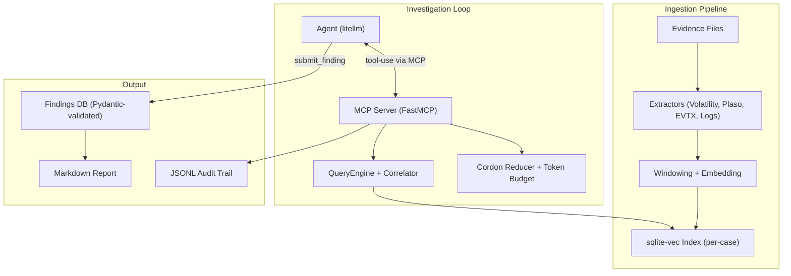

# Mulder

Custom MCP server for the SANS SIFT Workstation. Mulder ingests a forensic case once, builds a per-case semantic index of every log-like artifact extracted from the evidence, and then lets an autonomous AI agent query that index through typed, read-only forensic functions.

Submission target: **FIND EVIL!** hackathon (SANS, Apr 15 -- Jun 15 2026).

---

## Judges Start Here

### Option 1: Docker (recommended)

```bash
docker build -t mulder .
docker run -v /path/to/evidence:/cases mulder ingest /cases --case-id demo
docker run -v /path/to/evidence:/cases mulder investigate --case-id demo
```

### Option 2: Direct Install on SIFT Workstation

```bash
pip install -e .
mulder ingest /cases/sample-case/ --case-id demo
mulder investigate --case-id demo --model claude-sonnet-4-20250514
```

The investigation produces a Markdown report at `~/.mulder/cases/demo.report.md` and a JSONL audit trail at `~/.mulder/cases/demo.audit.jsonl`. Every finding in the report links back to specific tool calls, which link back to the original evidence files with SHA-256 hashes.

---

## What It Does

Mulder replaces the "run Volatility, grep logs, copy-paste into report" manual DFIR workflow with an autonomous agent that:

1. **Ingests** memory dumps, disk images, event logs, and text logs through specialized extractors.
2. **Indexes** all extracted text into a per-case sqlite-vec semantic database with windowed embeddings.
3. **Investigates** the index autonomously using an LLM agent connected via MCP, calling typed read-only forensic tools.
4. **Validates** every finding at the API boundary -- Pydantic rejects findings that lack evidence references or cite non-existent tool calls.
5. **Reports** with a full provenance chain: finding -> tool calls -> sources -> original evidence files (with SHA-256 hashes).

Evidence integrity is enforced by the API surface, not by prompts. The MCP tool list contains zero destructive verbs.

---

## Architecture



**Key architectural guardrail:** The MCP tool surface is entirely read-only. There are no shell-execution, file-write, or evidence-modification tools. The agent cannot spoliate evidence because the API does not contain destructive operations. Finding validation is enforced by Pydantic at the API boundary, not by prompt instructions.

---

## Installation

### Prerequisites

- Python >= 3.10
- For memory analysis: [Volatility 3](https://github.com/volatilityfoundation/volatility3) on `$PATH`
- For disk image timelines: [Plaso/log2timeline](https://plaso.readthedocs.io/) on `$PATH`
- An LLM API key (e.g. `ANTHROPIC_API_KEY`) for the investigation agent

### Install from source

```bash
pip install -e .

# Or with dev dependencies:
pip install -e ".[dev]"
```

### Using uv

```bash
uv venv
uv pip install -e ".[dev]"
```

---

## Usage

Mulder has a three-command UX:

### 1. Ingest evidence

```bash
mulder ingest /path/to/evidence/ --case-id my-case
```

Scans the evidence directory, classifies files by type, runs the appropriate extractors (Volatility, Plaso, EVTX parser, log reader), and builds a semantic index in `~/.mulder/cases/my-case.db`.

### 2. Investigate autonomously

```bash
mulder investigate --case-id my-case --model claude-sonnet-4-20250514
```

Spawns the MCP server internally and runs a thin LLM agent that:
- Surveys available evidence sources
- Runs composite forensic queries (suspicious processes, persistence mechanisms, lateral movement)
- Cross-verifies findings across multiple artifact types
- Submits validated findings with evidence references
- Generates a final Markdown report

### 3. Serve for external MCP clients (optional)

```bash
mulder serve --case-id my-case --transport stdio
mulder serve --case-id my-case --transport streamable-http
```

Exposes the Mulder tool surface to any MCP-compatible client (e.g. Claude Code, custom agents).

---

## How It Works

### Extraction

Each evidence type has a dedicated extractor that produces structured text output:

| Extractor | Handles | Output |
|-----------|---------|--------|
| Volatility | `.mem`, `.raw`, `.vmem`, `.dmp` | One source per plugin (pslist, pstree, cmdline, netscan, malfind, dlllist, svcscan, handles) |
| Plaso | `.E01`, `.dd`, `.img` | Super timeline as L2T CSV |
| Disk | Disk images | EVTX channels, prefetch, registry hives |
| Logs | `.log`, `.txt`, log directories | One source per file |

### Indexing

Extracted text is split into non-overlapping windows (4 lines each), embedded with `all-MiniLM-L6-v2`, and stored in a sqlite-vec database for fast k-NN queries.

### MCP Tool Surface

The agent interacts through typed, read-only tools:

| Tool | Purpose |
|------|---------|
| `list_sources` | Enumerate available evidence sources |
| `search` | Free-text semantic search across the index |
| `get_anomalies_in_range` | Anomaly-scored windows for a source and time range |
| `correlate_across_sources` | Cross-source correlation at a time range |
| `baseline_for` | Statistical baseline for a source |
| `find_suspicious_processes` | Composite: joins malfind + cmdline + netscan + pstree |
| `find_persistence_mechanisms` | Composite: joins registry + services + event logs |
| `find_lateral_movement_indicators` | Composite: joins logon events + network + RDP artifacts |
| `submit_finding` | Submit a validated finding with evidence refs |
| `finalize_report` | Generate the final Markdown report |

### Self-Correction

When `correlate_across_sources` returns conflicting information, the agent re-queries with adjusted parameters. Findings that cannot be corroborated by 2+ sources are demoted from "confirmed" to "inference".

---

## Project Structure

```
src/mulder/
  __init__.py
  cli.py                        # Click CLI (ingest, serve, investigate)
  db.py                         # Per-case sqlite-vec database lifecycle
  audit.py                      # JSONL audit log with provenance chains
  models.py                     # Pydantic models (WindowRow, Finding, etc.)

  extractors/
    base.py                     # Extractor protocol and registry
    classifier.py               # Evidence directory scanner
    volatility.py               # Volatility 3 plugin runner
    plaso.py                    # Plaso/log2timeline integration
    disk.py                     # Disk image mounting + artifact parsers
    logs.py                     # Text log ingestion

  index/
    embedder.py                 # Windowing + sentence-transformers embedding
    query.py                    # sqlite-vec k-NN queries, anomaly scoring
    correlator.py               # Cross-source correlation joins
    budget.py                   # Token budget planner
    reducer.py                  # Cordon-backed output reduction

  server/
    app.py                      # FastMCP server + tool registrations
    tools_core.py               # Core tool implementations
    tools_composite.py          # Composite forensic tools
    tools_findings.py           # submit_finding, finalize_report

  agent/
    investigator.py             # Thin agent loop (litellm + MCP client)
    prompts.py                  # System prompt + investigation strategy

  report/
    renderer.py                 # Jinja2 report renderer
    redactor.py                 # detect-secrets integration
    templates/
      report.md.j2              # Report template
```

---

## Submission Artifacts

- [Demo video script](docs/demo-script.md)
- [Devpost writeup](docs/devpost-writeup.md)
- [Accuracy report](docs/accuracy-report.md)
- [Dataset documentation](docs/dataset.md)

---

## License

Apache 2.0 -- see [LICENSE](LICENSE).
