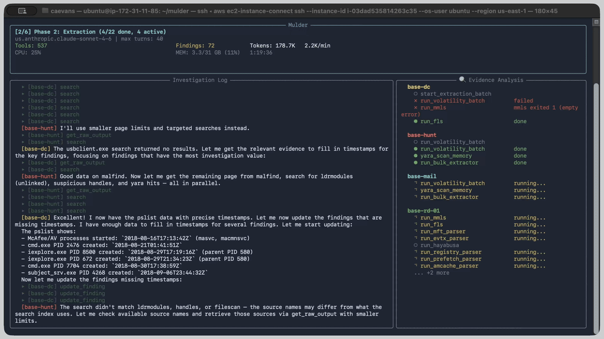

<div align="center">

# mulder


</div>

Mulder is an [MCP](https://modelcontextprotocol.io/) server and agentic orchestrator for digital forensics. It exposes 140+ typed forensic tools (Volatility 3, Sleuthkit, Plaso, Hayabusa, YARA, CAPA, Zeek, Chainsaw, and more) through the Model Context Protocol with no shell access, and includes a multi-phase agentic pipeline that runs full investigations autonomously with quality gates between phases.

<p align="center">
  
</p>

<p align="center">
  <b>Example report:</b>&nbsp;
  <a href="examples/srl-2018/SRL-2018.report.html">SRL-2018 APT Investigation</a> — <a href="https://www.sans.org/cyber-security-courses/advanced-incident-response-threat-hunting-training">SANS FOR508</a> enterprise intrusion capstone (395 sources, 99 findings, 80 MITRE ATT&CK techniques, 3.9 hours)
</p>

## Features

- **MCP server** with 140+ typed forensic tools covering memory, disk, timeline, Windows event logs, YARA, network capture, binary analysis, document forensics, email forensics, mobile, steganography, and more
- **Agentic pipeline** that decomposes investigations into five phases (Catalog, Extraction, Cross-System Analysis, Alternative Narrative, Report) with hard quality gates between each phase
- **Per-case SQLite database** with FTS5 full-text search across all indexed evidence
- **Append-only audit log** that records every tool invocation; findings must cite real tool call IDs to prevent hallucinated evidence citations
- **Cross-source correlation** to join evidence from different artifact types within a time range
- **Threat intelligence enrichment** with automated IOC lookups against public TI sources
- **Evidence gap detection** that identifies unexamined artifact types and coverage blind spots before reporting
- **Automatic finding deduplication** to merge per-host duplicates of the same artifact across systems
- **Rich Live dashboard** showing real-time investigation progress, per-model token usage, findings, and throughput
- **Report generation** producing Markdown, styled HTML, and PDF reports with IOC tables, MITRE ATT&CK coverage, and full audit trails
- **IOC export** in STIX 2.1 and CSV formats, plus MITRE ATT&CK Navigator layer generation
- **Resource throttling** with configurable memory and CPU limits so extractions do not overwhelm the host
- **Parallel extraction** with a configurable worker pool, background job management, and a `run_parallel` meta-tool for batch dispatch
- **Auto-compaction** that detects context window exhaustion and restarts phases with a compact prompt, recovering state from the database
- **Per-model token tracking** with role-based model assignment (planner, executor, analyst) and per-role usage breakdowns

### Example Output

From an automated investigation of the [SANS FOR508 enterprise intrusion capstone](https://www.sans.org/cyber-security-courses/advanced-incident-response-threat-hunting-training) (18 Windows systems, memory + disk + event logs):

```
Scope: 395 evidence sources (101 memory, 178 disk, 116 other) | 2250 tool calls | 3.9 hours
Results: 99 findings (13 critical, 41 high) | 80 MITRE ATT&CK techniques | 56 confirmed, 43 inference
Timeline: 2018-04-25 to 2018-09-07

Key Threats:
  - RAT C2 URL (psykooo.ddns.net/rat.php) carved from Domain Controller
  - 8+ nation-state malware families in memory (Codoso, HTran, PlugX, Industroyer)
  - C2 infrastructure: gicia.info, masgio.info, 174.122.240.164
  - PowerShell encoded command spawned via WMI
  - Anti-forensics: timestomping, log clearing, DLL unlinking
```

See [examples/srl-2018/](examples/srl-2018/) for the full HTML and Markdown reports.

## Getting Started

### Docker/Podman

The container image comes with all forensic tools, dependencies, and the Mulder MCP server pre-installed. The orchestrator runs inside the container, launching agent sessions that connect to the MCP server automatically.

```bash
docker pull ghcr.io/calebevans/mulder:1.1
```

#### Running the Container

The container runs as a non-root `mulder` user for security. An entrypoint script handles credential copying and permission setup automatically.

The container expects two volume mounts:

| Mount | Purpose |
|-------|---------|
| `/evidence` | Your evidence directory (mount read-only with `:ro`) |
| `/home/mulder/.mulder/cases` | Case databases, audit logs, and generated reports (persisted to host) |

**With an Anthropic API key:**

> Note: `--privileged` is required for FUSE-based evidence mounting (`ewfmount`, `guestmount`). For environments where this is unacceptable, use `--cap-add SYS_ADMIN --device /dev/fuse` instead.

```bash
mkdir -p ~/mulder-cases

docker run -it --privileged \
  -v /path/to/evidence:/evidence:ro \
  -v ~/mulder-cases:/home/mulder/.mulder/cases \
  -e ANTHROPIC_API_KEY=$ANTHROPIC_API_KEY \
  ghcr.io/calebevans/mulder:1.1
```

**With Google Cloud Vertex AI:**

```bash
mkdir -p ~/mulder-cases

docker run -it --privileged \
  -v /path/to/evidence:/evidence:ro \
  -v ~/mulder-cases:/home/mulder/.mulder/cases \
  -e CLAUDE_CODE_USE_VERTEX=1 \
  -e CLOUD_ML_REGION=us-east5 \
  -e ANTHROPIC_VERTEX_PROJECT_ID=your-gcp-project-id \
  -e GOOGLE_APPLICATION_CREDENTIALS=/tmp/gcloud-creds.json \
  -v ~/.config/gcloud/application_default_credentials.json:/tmp/gcloud-creds.json:ro \
  ghcr.io/calebevans/mulder:1.1
```

**With Amazon Bedrock:**

```bash
mkdir -p ~/mulder-cases

docker run -it --privileged \
  -v /path/to/evidence:/evidence:ro \
  -v ~/mulder-cases:/home/mulder/.mulder/cases \
  -e CLAUDE_CODE_USE_BEDROCK=1 \
  -e AWS_REGION=us-east-1 \
  -e AWS_ACCESS_KEY_ID=$AWS_ACCESS_KEY_ID \
  -e AWS_SECRET_ACCESS_KEY=$AWS_SECRET_ACCESS_KEY \
  ghcr.io/calebevans/mulder:1.1
```

#### Starting an Investigation

Use the `mulder investigate` command to run a full autonomous investigation. The `case_id` is a required positional argument that names the case database:

```bash
mulder investigate /evidence Rocba
```

The orchestrator will:
1. Catalog all evidence files and classify their types
2. Run per-system extraction (memory analysis, disk forensics, log parsing)
3. Perform cross-system correlation and MITRE ATT&CK mapping
4. Challenge the primary narrative with alternative hypotheses and audit for completeness
5. Generate a comprehensive investigation report

Case databases and reports are written to the mounted `~/mulder-cases` directory on the host.

#### Environment Variables

| Variable | Default | Description |
|----------|---------|-------------|
| `ANTHROPIC_API_KEY` | | API key for direct Anthropic access |
| `CLAUDE_CODE_USE_VERTEX` | | Set to `1` for Google Cloud Vertex AI |
| `CLAUDE_CODE_USE_BEDROCK` | | Set to `1` for Amazon Bedrock |

## Investigation Pipeline

Each phase (except catalog and report) uses a **plan-and-execute** pipeline with three specialized roles (planner, executor, analyst):

1. **Planner** (Sonnet): examines evidence, outputs a structured tool execution plan
2. **Executor** (Haiku): follows the plan, calls tools, reports results
3. **Analyst** (Sonnet): interprets results, submits findings

This reduces cost by routing mechanical tool-calling to a cheaper model while preserving reasoning quality for analysis.

| Role | Default Model | Responsibility |
|------|--------------|----------------|
| Planner | Sonnet | Decides what tools to run, produces execution plans |
| Executor | Haiku | Calls tools mechanically, manages waits and retries |
| Analyst | Sonnet | Queries indexed data, reasons about evidence, submits findings |

### Phases

| Phase | Objective | Mode |
|-------|-----------|------|
| 1. Catalog | Enumerate and classify all evidence files, identify distinct systems | Single (Planner model) |
| 2. Extraction | Run all applicable forensic tools per system, submit findings | Split (per system) |
| 3. Cross-System | Correlate events across systems, map MITRE ATT&CK, consolidate findings | Split |
| 4. Alternative Narrative | Challenge primary narrative, search for counter-evidence, audit for completeness and coverage gaps | Split |
| 5. Report | Write investigation narrative and generate the final report | Single (Analyst model) |

Each phase passes through a quality gate before proceeding. Failed gates trigger retries with increased turn limits and gap-specific remediation instructions. The analyst can request follow-up cycles (capped at a maximum per phase) when it needs additional tool execution.

## CLI Reference

### `mulder investigate <evidence_path> <case_id>`

Runs a full multi-phase forensic investigation using the agentic pipeline.

| Argument | Description |
|----------|-------------|
| `evidence_path` | Filesystem path to the evidence directory |
| `case_id` | Unique identifier for this investigation (used as the database filename) |

| Option | Default | Description |
|--------|---------|-------------|
| `--model` | None | Fallback model for all roles |
| `--planner-model` | `claude-sonnet-4-6` | Model for planner agents (decides what tools to run) |
| `--executor-model` | `claude-haiku-4-5` | Model for executor agents (calls tools, manages waits) |
| `--analyst-model` | `claude-sonnet-4-6` | Model for analyst agents (interprets results, submits findings) |
| `--config` | None | YAML config file for models and settings |
| `--effort` | `max` | Effort level for agent sessions (`max`, `xhigh`, `high`) |
| `--workers` | `3` | Max concurrent extraction agent sessions (not tool threads) |
| `--db-dir` | `~/.mulder/cases` | Case database directory |
| `--cwd` | `/mulder-investigation` | Working directory for agent sessions |
| `--proxy-config` | None | LiteLLM config YAML for custom model routing |

**Cost-optimized (recommended):**

```bash
mulder investigate /evidence Rocba \
  --planner-model claude-sonnet-4-6 \
  --executor-model claude-haiku-4-5 \
  --analyst-model claude-sonnet-4-6
```

**Single model (simple):**

```bash
mulder investigate /evidence Rocba --model claude-sonnet-4-6
```

**Config file:**

```bash
mulder investigate /evidence Rocba --config investigation.yaml
```

All roles inherit from `--model` when not explicitly set, so a single `--model` flag is sufficient for providers that use a unified model identifier.

**Non-Anthropic models** (via built-in LiteLLM proxy, supports Bedrock, OpenAI, Vertex AI, Ollama):

```bash
# Use a Bedrock-hosted Llama model for all roles
mulder investigate /evidence Rocba \
  --model bedrock/meta.llama3-1-70b-instruct-v1:0

# Mix providers: Llama for execution, Claude for planning and analysis
mulder investigate /evidence Rocba \
  --executor-model bedrock/meta.llama3-1-70b-instruct-v1:0 \
  --planner-model claude-sonnet-4-6 \
  --analyst-model claude-sonnet-4-6

# Use a local Ollama model
mulder investigate /evidence Rocba \
  --model ollama/llama3.1:70b
```

When any model ID uses a provider prefix (`bedrock/`, `openai/`, `vertex_ai/`, `azure/`, `ollama/`), a local LiteLLM proxy is auto-started to translate between the Anthropic API format and the target provider. No manual proxy setup is required.

For advanced routing, pass a custom LiteLLM config:

```bash
mulder investigate /evidence Rocba \
  --proxy-config ./litellm_config.yaml \
  --model my-custom-deployment
```

| Option | Default | Description |
|--------|---------|-------------|
| `--proxy-config` | None | Path to a LiteLLM config YAML for custom model routing |

### `mulder serve`

Starts the MCP server. Normally invoked automatically by the orchestrator or MCP client configuration.

| Option | Default | Description |
|--------|---------|-------------|
| `--case-id` | None | Pre-load an existing case on startup |
| `--db-dir` | `~/.mulder/cases` | Directory for per-case databases and audit logs |
| `--transport` | `stdio` | MCP transport (`stdio` or `streamable-http`) |
| `--workers` | `8` | Concurrent tool execution threads for the MCP server |
| `--mem-limit` | `90` | Memory usage % threshold; tools wait when exceeded (0 to disable) |
| `--cpu-limit` | `90` | CPU usage % threshold; tools wait when exceeded (0 to disable) |

### `mulder report <case_id>`

Generates reports (Markdown, HTML, and PDF) offline without starting the MCP server.

| Option | Default | Description |
|--------|---------|-------------|
| `--db-dir` | `~/.mulder/cases` | Directory containing case databases |

Reads `{case_id}.db` and `{case_id}.audit.jsonl` from the database directory and writes `{case_id}.report.md`, `{case_id}.report.html`, and `{case_id}.report.pdf` alongside them.

### `mulder export-iocs <case_id>`

Exports IOCs from a completed case in STIX 2.1 or CSV format.

| Option | Default | Description |
|--------|---------|-------------|
| `--db-dir` | `~/.mulder/cases` | Directory containing case databases |
| `--format` | `stix` | Output format (`stix` or `csv`) |

### `mulder export-navigator <case_id>`

Generates a MITRE ATT&CK Navigator layer JSON from a completed case.

| Option | Default | Description |
|--------|---------|-------------|
| `--db-dir` | `~/.mulder/cases` | Directory containing case databases |

## Supported Forensic Tools

| Tool | Description |
|------|-------------|
| [Volatility 3](https://github.com/volatilityfoundation/volatility3) | Memory forensics framework for analyzing RAM dumps |
| [Sleuthkit](https://www.sleuthkit.org/) | Disk image analysis, filesystem listing, file extraction, and MAC timelines |
| [Plaso](https://github.com/log2timeline/plaso) | Super-timeline generation from disk images and log artifacts |
| [Hayabusa](https://github.com/Yamato-Security/hayabusa) | Windows event log threat hunting with Sigma rules |
| [YARA](https://virustotal.github.io/yara/) | Pattern matching across files, memory dumps, and Volatility output |
| [bulk_extractor](https://github.com/simsong/bulk_extractor) | Carves emails, URLs, credit card numbers, and other IOCs from raw data |
| [Eric Zimmerman tools](https://ericzimmerman.github.io/) | Windows artifact parsers (Prefetch, Amcache, ShimCache, Jump Lists, LNK, Shellbags, SRUM, MFT, USN Journal) |
| [RegRipper](https://github.com/keydet89/RegRipper3.0) | Windows registry hive parsing |
| [python-evtx](https://github.com/williballenthin/python-evtx) | Windows EVTX event log parsing and indexing |
| [foremost](https://foremost.sourceforge.net/) | File carving from disk images |
| [Scalpel](https://github.com/sleuthkit/scalpel) | File carving and recovery |
| [PhotoRec](https://www.cgsecurity.org/wiki/PhotoRec) | File recovery from disk images |
| [Binwalk](https://github.com/ReFirmLabs/binwalk) | Firmware and embedded file analysis |
| [ClamAV](https://www.clamav.net/) | Malware scanning |
| [ExifTool](https://exiftool.org/) | File metadata extraction |
| [ssdeep](https://ssdeep-project.github.io/ssdeep/) | Fuzzy hashing for file similarity |
| [hashdeep](https://github.com/jessek/hashdeep) | Recursive cryptographic hashing |
| [tshark](https://www.wireshark.org/docs/man-pages/tshark.html) | Network capture (PCAP) analysis |
| [chkrootkit](http://www.chkrootkit.org/) | Rootkit detection |
| [steghide](https://steghide.sourceforge.net/) / stegdetect | Steganography detection and extraction |
| [strings](https://man7.org/linux/man-pages/man1/strings.1.html) | Extract printable strings from binary files |
| [pasco](https://www.mcafee.com/enterprise/en-us/downloads/free-tools.html) | Internet Explorer history parsing |
| [Hindsight](https://github.com/obsidianforensics/hindsight) | Chrome/Chromium browser forensics (history, cookies, downloads, cache) |
| [MVT](https://github.com/mvt-project/mvt) | Mobile Verification Toolkit for spyware detection (Pegasus, Predator) |
| [radare2](https://github.com/radareorg/radare2) | Binary analysis and reverse engineering for malware triage |
| [dislocker](https://github.com/Aorimn/dislocker) / [libbde](https://github.com/libyal/libbde) | BitLocker volume decryption and metadata extraction |
| [libfvde](https://github.com/libyal/libfvde) | Apple FileVault encryption metadata extraction |
| [tcpflow](https://github.com/simsong/tcpflow) / [tcpxtract](https://tcpxtract.sourceforge.net/) | TCP stream reconstruction and file extraction from PCAPs |
| [CAPA](https://github.com/mandiant/capa) | Capability detection with MITRE ATT&CK mapping |
| [FLOSS](https://github.com/mandiant/flare-floss) | Obfuscated string extraction from malware samples |
| [Detect-It-Easy](https://github.com/horsicq/Detect-It-Easy) | Packer, compiler, and protector identification |
| [oletools](https://github.com/decalage2/oletools) | Microsoft Office malware analysis |
| [Didier Stevens PDF tools](https://github.com/DidierStevens/DidierStevensSuite) | PDF malware triage and structure analysis |
| [pst-utils / libpst](https://www.five-ten-sg.com/libpst/) | Outlook PST/OST email forensics |
| [Zeek](https://zeek.org/) | Network protocol analysis and structured log generation |
| [Suricata](https://suricata.io/) | IDS signature matching against network captures |
| [Chainsaw](https://github.com/WithSecureLabs/chainsaw) | Windows EVTX, MFT, and SRUM analysis with Sigma rules |
| [Zircolite](https://github.com/wagga40/Zircolite) | Sigma detection for Linux Auditd and Sysmon logs |
| [ALEAPP](https://github.com/abrignoni/ALEAPP) | Android forensic artifact parsing (300+ artifact types) |
| [iLEAPP](https://github.com/abrignoni/iLEAPP) | iOS forensic artifact parsing (200+ artifact types) |

## Report Generation

Mulder generates three report formats from the case database and audit log:

- **Markdown** (`{case_id}.report.md`) for plain-text review and version control
- **HTML** (`{case_id}.report.html`) a self-contained styled page with dark/light theme, sidebar navigation, and interactive layout
- **PDF** (`{case_id}.report.pdf`) for formal distribution and archival

All formats include an executive summary, severity overview, evidence integrity hashes, attack timeline, detailed findings with MITRE ATT&CK mappings, IOC tables (network, file, email), audit metrics, and a sources appendix.

Additionally, the report phase produces:

- **IOC export** in STIX 2.1 (`{case_id}.stix.json`) and CSV (`{case_id}.iocs.csv`) formats
- **MITRE ATT&CK Navigator layer** (`{case_id}.navigator.json`) for visualization in the Navigator web app

Reports and exports can be generated in two ways:

1. **Automatically** by the orchestrator at the end of a successful investigation
2. **CLI**: run `mulder report <case_id>` offline without starting the server

## Contributing

- [Adding a New MCP Tool](docs/adding-tools.md) — step-by-step guide covering tool creation, role assignment, DB indexing, skip logic, and testing

## Architecture

See [docs/architecture.md](docs/architecture.md) for a detailed technical overview of the server internals, orchestration pipeline, database schema, and security model.
