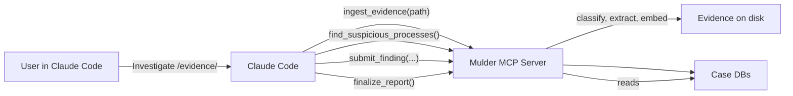

# Mulder

Custom MCP server that gives Claude Code forensic investigation superpowers on the SANS SIFT Workstation. Mulder ingests forensic evidence (disk images, memory dumps, event logs), builds a per-case semantic index, and exposes 50+ typed, read-only forensic tools that Claude Code uses to investigate autonomously.

Submission target: **FIND EVIL!** hackathon (SANS, Apr 15 -- Jun 15 2026).

---

## Judges Start Here

### Option 1: Docker (recommended)

The Docker image includes all forensic tools pre-installed (Volatility 3, Plaso, Sleuth Kit, YARA, bulk\_extractor, Eric Zimmerman Tools, Claude Code).

```bash
docker build -t mulder .

docker run -it \
  -v /path/to/evidence:/evidence:ro \
  -v ./output:/root/.mulder/cases \
  -e ANTHROPIC_API_KEY \
  mulder
```

Then in Claude Code, ask:
```
Investigate the evidence at /evidence/ for signs of compromise.
```

### Option 2: Direct Install on SIFT Workstation

```bash
pip install -e .
npm install -g @anthropic-ai/claude-code

# Start Claude Code in the mulder project directory
cd /path/to/mulder
claude
```

Then ask Claude to investigate any evidence directory. Claude uses the Mulder MCP tools automatically -- no manual commands needed.

Reports are saved to `~/.mulder/cases/<case-id>.report.md` with a JSONL audit trail at `~/.mulder/cases/<case-id>.audit.jsonl`. Every finding in the report links back to specific tool calls, which link back to the original evidence files with SHA-256 hashes.

---

## What It Does

Mulder replaces the "run Volatility, grep logs, copy-paste into report" manual DFIR workflow. It is a **Custom MCP Server** (hackathon approach #2) that:

1. **Ingests** memory dumps, disk images, event logs, and text logs through specialized extractors (via the `ingest_evidence` MCP tool).
2. **Indexes** all extracted text into a per-case sqlite-vec semantic database with windowed embeddings.
3. **Exposes 50+ read-only forensic tools** via MCP that Claude Code uses to investigate autonomously.
4. **Validates** every finding at the API boundary -- Pydantic rejects findings that lack evidence references or cite non-existent tool calls.
5. **Reports** with a full provenance chain: finding -> tool calls -> sources -> original evidence files (with SHA-256 hashes).

Evidence integrity is enforced by the API surface, not by prompts. The MCP tool list contains zero destructive verbs.

---

## Architecture



**Key architectural guardrail:** The MCP tool surface is entirely read-only. There are no shell-execution, file-write, or evidence-modification tools. The agent cannot spoliate evidence because the API does not contain destructive operations. Finding validation is enforced by Pydantic at the API boundary, not by prompt instructions.

---

## Installation

### Prerequisites

- Python >= 3.10
- [Claude Code](https://code.claude.com/) (`npm install -g @anthropic-ai/claude-code`)
- `ANTHROPIC_API_KEY` environment variable
- For memory analysis: [Volatility 3](https://github.com/volatilityfoundation/volatility3) on `$PATH`
- For disk image timelines: [Plaso/log2timeline](https://plaso.readthedocs.io/) on `$PATH`
- For filesystem analysis: [Sleuth Kit](https://www.sleuthkit.org/) on `$PATH`

### Install from source

```bash
pip install -e .
```

### Using uv

```bash
uv venv
uv pip install -e ".[dev]"
```

---

## Usage

### Interactive (recommended)

Start Claude Code in the mulder project directory. The `.mcp.json` config automatically connects Claude to the Mulder MCP server.

```bash
cd /path/to/mulder
claude
```

Then ask Claude to investigate:

```
Investigate the evidence at /home/user/cases/SRL-2015-Compromised-Enterprise-Network/
```

Claude will call `ingest_evidence`, run the full investigation using 50+ forensic tools, submit validated findings, and generate a Markdown report.

### Standalone CLI

For advanced users or scripting, the `ingest` and `serve` commands are available:

```bash
mulder ingest /path/to/evidence/ --case-id my-case
mulder serve --case-id my-case --transport stdio
```

The `serve` command exposes the Mulder MCP tool surface to any MCP-compatible client.

### Embedding Configuration

By default, Mulder uses local embeddings (`sentence-transformers/all-MiniLM-L6-v2`) requiring no API keys beyond `ANTHROPIC_API_KEY`. For better quality, configure remote embeddings in `.mcp.json`:

```json
{
  "mcpServers": {
    "mulder": {
      "type": "stdio",
      "command": "mulder",
      "args": ["serve", "--embedding-backend", "remote", "--embedding-model", "gemini/gemini-embedding-001"],
      "env": {"GEMINI_API_KEY": "your-key"}
    }
  }
}
```

---

## How It Works

### Extraction

Each evidence type has a dedicated extractor that produces structured text output:

| Extractor | Handles | Output |
|-----------|---------|--------|
| Volatility | `.mem`, `.raw`, `.vmem`, `.dmp`, `.001` | One source per plugin (pslist, pstree, cmdline, netscan, malfind, etc.) |
| Plaso | `.E01`, `.dd`, `.img` | Super timeline as L2T CSV |
| Sleuth Kit | `.E01`, `.dd`, `.img` | Filesystem listing, timeline, deleted files |
| EZ Tools | Mounted artifacts | Prefetch, Amcache, ShimCache, MFT, USN Journal, etc. |
| Bulk Extractor | `.E01`, `.dd`, `.img` | Carved IOCs (URLs, IPs, emails) |
| Disk | Disk images, `.evtx` | EVTX channels, prefetch, registry hives |
| Logs | `.log`, `.txt`, log directories | One source per file |

### Indexing

Extracted text is split into non-overlapping windows, embedded (locally or via remote API), and stored in a sqlite-vec database for fast k-NN queries.

### MCP Tool Surface (50+ tools)

| Category | Tools | Purpose |
|----------|-------|---------|
| Case Management | `ingest_evidence`, `list_cases`, `open_case` | Ingest and switch between cases |
| Core Query | `list_sources`, `search`, `get_anomalies_in_range`, `correlate_across_sources`, `baseline_for` | Semantic search and anomaly detection |
| Composite | `find_suspicious_processes`, `find_persistence_mechanisms`, `find_lateral_movement_indicators`, `find_defense_evasion`, `find_execution_evidence`, `find_data_exfiltration_indicators` | Multi-source forensic queries |
| Volatility | `list_processes_from_memory`, `get_process_tree`, `scan_hidden_processes`, `scan_kernel_modules`, etc. | Memory analysis |
| Sleuth Kit | `list_files`, `get_deleted_files`, `get_fs_timeline`, `extract_file_by_inode` | Filesystem forensics |
| EZ Tools | `parse_prefetch_detailed`, `parse_amcache`, `parse_shimcache`, `parse_mft`, etc. | Windows artifact parsing |
| YARA | `yara_scan_files`, `yara_scan_memory` | Threat hunting |
| Findings | `submit_finding`, `get_findings`, `finalize_report` | Validated finding submission and reporting |

### Self-Correction

When `correlate_across_sources` returns conflicting information, the agent re-queries with adjusted parameters. Findings that cannot be corroborated by 2+ sources are demoted from "confirmed" to "inference".

---

## Project Structure

```
src/mulder/
  cli.py                        # Click CLI (ingest, serve)
  db.py                         # Per-case sqlite-vec database lifecycle
  audit.py                      # JSONL audit log with provenance chains
  models.py                     # Pydantic models (WindowRow, Finding, etc.)

  extractors/
    base.py                     # Extractor protocol and registry
    classifier.py               # Evidence directory scanner
    volatility.py               # Volatility 3 plugin runner
    plaso.py                    # Plaso/log2timeline integration
    sleuthkit.py                # Sleuth Kit filesystem analysis
    eztools.py                  # Eric Zimmerman tools
    bulk.py                     # bulk_extractor IOC carving
    disk.py                     # Disk image mounting + artifact parsers
    logs.py                     # Text log ingestion

  index/
    embedder.py                 # Windowing + embedding (local or remote)
    query.py                    # sqlite-vec k-NN queries, anomaly scoring
    correlator.py               # Cross-source correlation joins
    budget.py                   # Token budget planner
    reducer.py                  # Cordon-backed output reduction

  server/
    app.py                      # FastMCP server + dynamic case context
    tools_ingest.py             # ingest_evidence, list_cases, open_case
    tools_core.py               # Core query tools
    tools_composite.py          # Multi-source composite forensic tools
    tools_findings.py           # submit_finding, finalize_report
    tools_tsk.py                # Sleuth Kit tools
    tools_eztools.py            # EZ Tools
    tools_plaso.py              # Plaso timeline tools
    tools_yara.py               # YARA scanning tools
    tools_bulk.py               # bulk_extractor tools

  report/
    renderer.py                 # Jinja2 report renderer
    redactor.py                 # detect-secrets integration
    templates/
      report.md.j2              # Report template

.mcp.json                       # Claude Code MCP server config
.claude/skills/investigate.md   # Investigation strategy skill
```

---

## Submission Artifacts

- [Demo video script](docs/demo-script.md)
- [Devpost writeup](docs/devpost-writeup.md)
- [Accuracy report](docs/accuracy-report.md)
- [Dataset documentation](docs/dataset.md)

---

## License

Apache 2.0 -- see [LICENSE](LICENSE).
