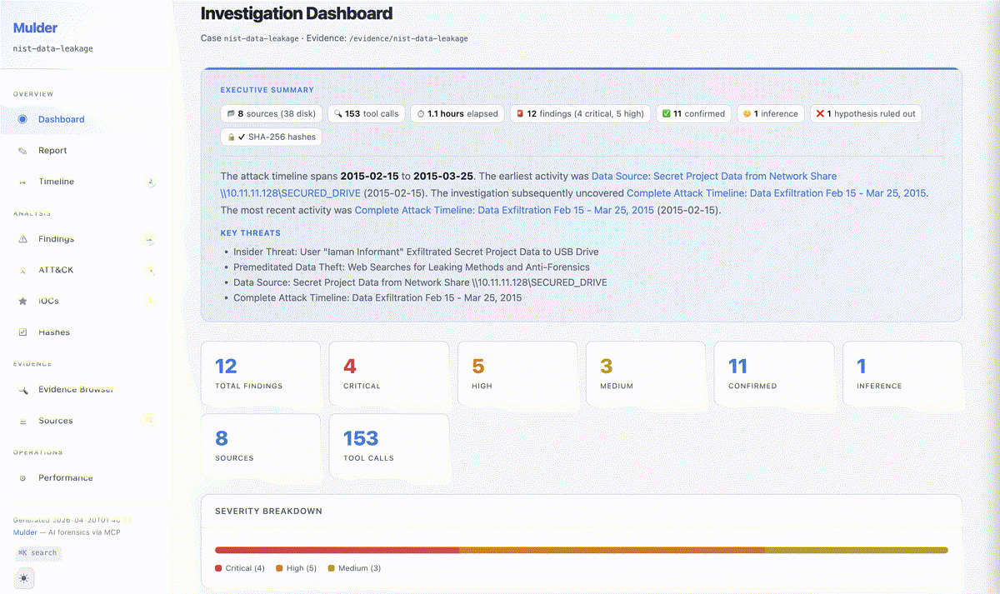

<div align="center">

# mulder


</div>

Mulder is an [MCP](https://modelcontextprotocol.io/) server for digital forensics on [SANS SIFT](https://www.sans.org/tools/sift-workstation/) workstations. It gives an AI agent the ability to create investigation cases, run forensic tools (Volatility 3, Sleuthkit, Plaso, Hayabusa, YARA, and more), index evidence into a searchable SQLite database, submit provenance-tracked findings, and generate investigation reports.

<p align="center">
  
</p>

## Features

- **MCP protocol** for connecting to any compatible AI client (Claude Desktop, Cursor, Claude Code, etc.)
- **40+ forensic tools** exposed as MCP tool calls covering memory, disk, timeline, Windows event logs, YARA, network capture, mobile, and more
- **Per-case SQLite database** with FTS5 full-text search across all indexed evidence
- **Append-only audit log** that records every tool invocation; findings must cite real tool call IDs to prevent hallucinated evidence
- **Cross-source correlation** to join evidence from different artifact types within a time range
- **Report generation** producing both Markdown and styled HTML reports with IOC tables, MITRE ATT&CK coverage, and full audit trails
- **Resource throttling** with configurable memory and CPU limits so extractions do not overwhelm the host
- **Parallel extraction** with a configurable worker pool and a `run_parallel` meta-tool for batch dispatch

### Example Output

From the agent's live terminal during a [NIST insider threat investigation](examples/nist-data-leakage/):

```
● BOMBSHELL: Informant's Downloads folder contains:
  - googledrivesync.exe + Zone.Identifier (downloaded from internet!)
  - icloudsetup.exe + Zone.Identifier (also downloaded from internet!)

  Multi-vector exfiltration: USB drives (×2), CD-R burn, Google Drive cloud
  sync, and possibly iCloud!

● SMOKING GUN — Browser Search Queries Show Premeditation:
  search?q=anti-forensic+tools      (n=85)
  search?q=ccleaner                 (n=65)
  search?q=cd+burning+method        (n=64)
  search?q=external+device+forensics (n=65)
  search?q=DLP+DRM                  (n=90)
  search?q=e-mail+investigation     (n=88)

  The informant researched how to cover their tracks AND how forensic
  investigations work. This is deliberate, premeditated data theft.

● EXPLOSIVE FIND: LNK shows network share accessed:
  \\10.11.11.128\secured_drive\Secret Project Data\final
  on 2015-03-22T14:52:21Z (drive V:).

  This is the server where the secret project files were stored!
```

14 findings, 9 critical, 34 minutes. Full report with narrative, IOCs, and MITRE ATT&CK mappings generated automatically.

See [examples/](examples/) for reports from multiple forensic datasets with ground truth comparisons, including runs on both Opus and Sonnet.

## Getting Started

### Docker/Podman

The container image comes with all forensic tools, dependencies, and [Claude Code](https://docs.anthropic.com/en/docs/agents-and-tools/claude-code/overview) pre-installed. Mulder is already registered as an MCP server in the container, so Claude Code can use it immediately.

```bash
docker pull ghcr.io/calebevans/mulder:1.0
```

#### Running the Container

The container expects three volume mounts:

| Mount | Purpose |
|-------|---------|
| `/evidence` | Your evidence directory (mount read-only with `:ro`) |
| `/root/.mulder/cases` | Case databases, audit logs, and generated reports (persisted to host) |
| `/root/.claude` | Claude Code configuration and session data |

**With an Anthropic API key:**

```bash
mkdir -p ~/mulder-cases

docker run -it --privileged \
  -v /path/to/evidence:/evidence:ro            `# evidence directory (read-only)` \
  -v ~/mulder-cases:/root/.mulder/cases        `# case DBs, audit logs, reports` \
  -v ~/.claude:/root/.claude                   `# Claude Code config and sessions` \
  -e ANTHROPIC_API_KEY=$ANTHROPIC_API_KEY \
  ghcr.io/calebevans/mulder:1.0
```

**With Google Cloud Vertex AI:**

```bash
mkdir -p ~/mulder-cases

docker run -it --privileged \
  -v /path/to/evidence:/evidence:ro            `# evidence directory (read-only)` \
  -v ~/mulder-cases:/root/.mulder/cases        `# case DBs, audit logs, reports` \
  -v ~/.claude:/root/.claude                   `# Claude Code config and sessions` \
  -e CLAUDE_CODE_USE_VERTEX=1 \
  -e CLOUD_ML_REGION=us-east5 \
  -e ANTHROPIC_VERTEX_PROJECT_ID=your-gcp-project-id \
  -e GOOGLE_APPLICATION_CREDENTIALS=/tmp/gcloud-creds.json \
  -v ~/.config/gcloud/application_default_credentials.json:/tmp/gcloud-creds.json:ro `# GCP credentials` \
  ghcr.io/calebevans/mulder:1.0
```

**With Amazon Bedrock:**

```bash
mkdir -p ~/mulder-cases

docker run -it --privileged \
  -v /path/to/evidence:/evidence:ro            `# evidence directory (read-only)` \
  -v ~/mulder-cases:/root/.mulder/cases        `# case DBs, audit logs, reports` \
  -v ~/.claude:/root/.claude                   `# Claude Code config and sessions` \
  -e CLAUDE_CODE_USE_BEDROCK=1 \
  -e AWS_REGION=us-east-1 \
  -e AWS_ACCESS_KEY_ID=$AWS_ACCESS_KEY_ID \
  -e AWS_SECRET_ACCESS_KEY=$AWS_SECRET_ACCESS_KEY \
  ghcr.io/calebevans/mulder:1.0
```

The container starts Claude Code directly. Once inside, use the `/investigate` slash command to begin:

```
/investigate /evidence/case-2025-001
```

Point it at the directory where your evidence is mounted. The directory can contain archives (zip, 7z, gz, tar, tar.gz, etc.) — the agent will automatically extract them into a temporary directory and read from there.

Case databases and reports are written to the mounted `~/mulder-cases` directory on the host.

## CLI Reference

### `mulder serve`

Starts the MCP server. Normally you do not need to run this manually; the MCP client configuration handles it.

| Option | Default | Description |
|--------|---------|-------------|
| `--case-id` | None | Pre-load an existing case on startup |
| `--db-dir` | `~/.mulder/cases` | Directory for per-case databases and audit logs |
| `--transport` | `stdio` | MCP transport (`stdio` or `streamable-http`) |
| `--workers` | `8` | Number of parallel extraction workers |
| `--mem-limit` | `90` | Memory usage % threshold; tools wait when exceeded (0 to disable) |
| `--cpu-limit` | `90` | CPU usage % threshold; tools wait when exceeded (0 to disable) |

### `mulder report <case_id>`

Generates reports offline without starting the MCP server.

| Option | Default | Description |
|--------|---------|-------------|
| `--db-dir` | `~/.mulder/cases` | Directory containing case databases |

Reads `{case_id}.db` and `{case_id}.audit.jsonl` from the database directory and writes `{case_id}.report.md` and `{case_id}.report.html` alongside them.

## Supported Forensic Tools

| Tool | Description |
|------|-------------|
| [Volatility 3](https://github.com/volatilityfoundation/volatility3) | Memory forensics framework for analyzing RAM dumps |
| [Sleuthkit](https://www.sleuthkit.org/) | Disk image analysis, filesystem listing, file extraction, and MAC timelines |
| [Plaso](https://github.com/log2timeline/plaso) | Super-timeline generation from disk images and log artifacts |
| [Hayabusa](https://github.com/Yamato-Security/hayabusa) | Windows event log threat hunting with Sigma rules |
| [YARA](https://virustotal.github.io/yara/) | Pattern matching across files, memory dumps, and Volatility output |
| [bulk_extractor](https://github.com/simsong/bulk_extractor) | Carves emails, URLs, credit card numbers, and other IOCs from raw data |
| [Eric Zimmerman tools](https://ericzimmerman.github.io/) | Windows artifact parsers (Prefetch, Amcache, ShimCache, Jump Lists, LNK, Shellbags, SRUM, MFT, USN Journal) |
| [RegRipper](https://github.com/keydet89/RegRipper3.0) | Windows registry hive parsing |
| [python-evtx](https://github.com/williballenthin/python-evtx) | Windows EVTX event log parsing and indexing |
| [foremost](https://foremost.sourceforge.net/) | File carving from disk images |
| [Scalpel](https://github.com/sleuthkit/scalpel) | File carving and recovery |
| [PhotoRec](https://www.cgsecurity.org/wiki/PhotoRec) | File recovery from disk images |
| [Binwalk](https://github.com/ReFirmLabs/binwalk) | Firmware and embedded file analysis |
| [ClamAV](https://www.clamav.net/) | Malware scanning |
| [ExifTool](https://exiftool.org/) | File metadata extraction |
| [ssdeep](https://ssdeep-project.github.io/ssdeep/) | Fuzzy hashing for file similarity |
| [hashdeep](https://github.com/jessek/hashdeep) | Recursive cryptographic hashing |
| [tshark](https://www.wireshark.org/docs/man-pages/tshark.html) | Network capture (PCAP) analysis |
| [chkrootkit](http://www.chkrootkit.org/) | Rootkit detection |
| [steghide](https://steghide.sourceforge.net/) / stegdetect | Steganography detection and extraction |
| [strings](https://man7.org/linux/man-pages/man1/strings.1.html) | Extract printable strings from binary files |
| [pasco](https://www.mcafee.com/enterprise/en-us/downloads/free-tools.html) | Internet Explorer history parsing |
| [Hindsight](https://github.com/obsidianforensics/hindsight) | Chrome/Chromium browser forensics (history, cookies, downloads, cache) |
| [MVT](https://github.com/mvt-project/mvt) | Mobile Verification Toolkit for spyware detection (Pegasus, Predator) |
| [radare2](https://github.com/radareorg/radare2) | Binary analysis and reverse engineering for malware triage |
| [dislocker](https://github.com/Aorimn/dislocker) / [libbde](https://github.com/libyal/libbde) | BitLocker volume decryption and metadata extraction |
| [libfvde](https://github.com/libyal/libfvde) | Apple FileVault encryption metadata extraction |
| [tcpflow](https://github.com/simsong/tcpflow) / [tcpxtract](https://tcpxtract.sourceforge.net/) | TCP stream reconstruction and file extraction from PCAPs |

## Report Generation

Mulder generates two report formats from the case database and audit log:

- **Markdown** (`{case_id}.report.md`) for plain-text review and version control
- **HTML** (`{case_id}.report.html`) a self-contained styled page with dark/light theme, sidebar navigation, and interactive layout

Both formats include an executive summary, severity overview, evidence integrity hashes, attack timeline, detailed findings with MITRE ATT&CK mappings, IOC tables (network, file, email), audit metrics, and a sources appendix.

Reports can be generated in two ways:

1. **MCP tool**: call `finalize_report` while a case is loaded in the server
2. **CLI**: run `mulder report <case_id>` offline without starting the server

## Architecture

See [docs/architecture.md](docs/architecture.md) for a detailed technical overview of the server internals, data model, tool execution model, and evidence pipeline.

