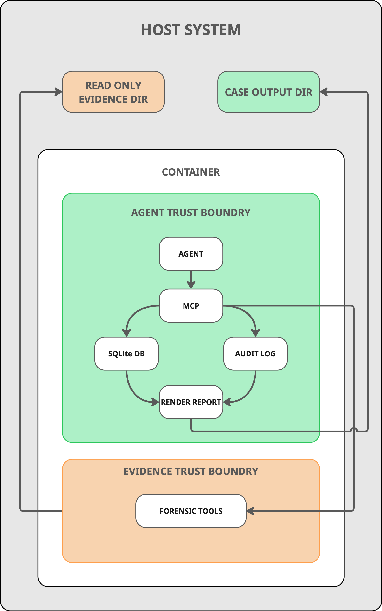
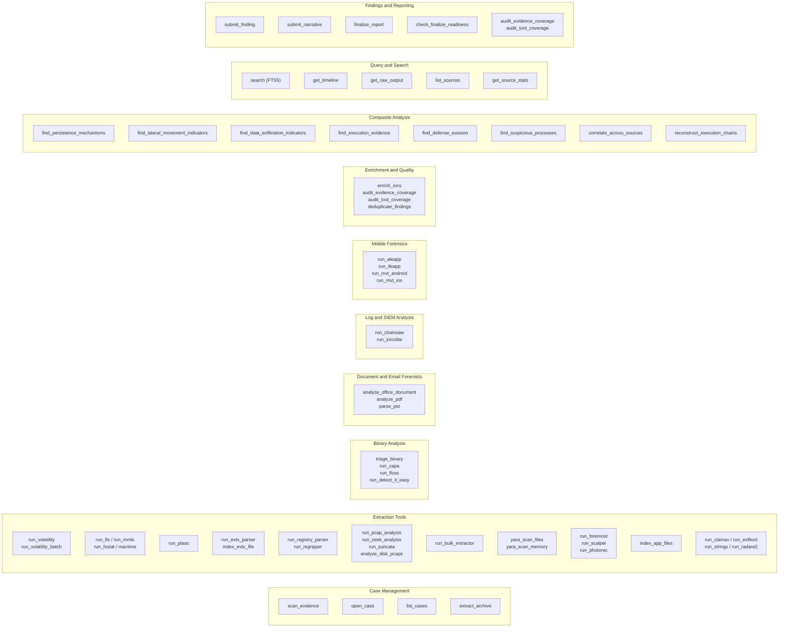
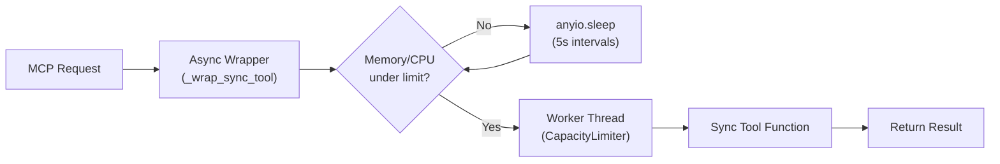
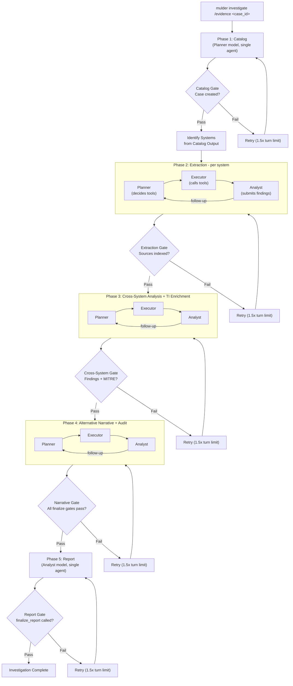
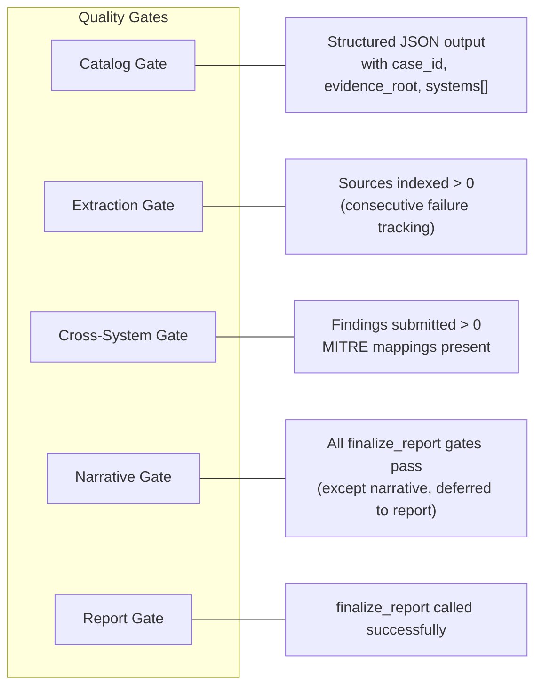
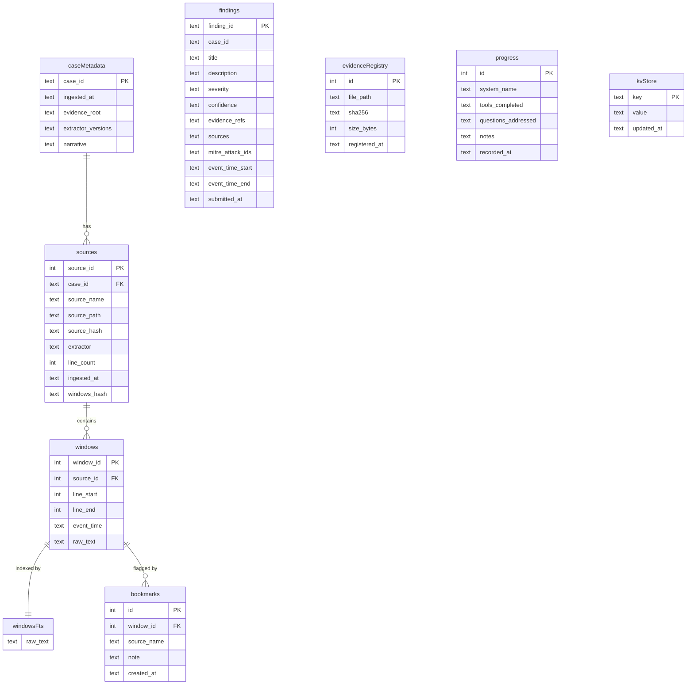

# Architecture

Mulder is a forensic investigation platform consisting of two core components: an MCP server that exposes 140+ typed forensic tools with no shell access, and an agentic orchestrator that runs multi-phase investigations with quality gates.

## System Overview

<p align="center">

</p>

## MCP Server Architecture

The MCP server (`mulder serve`) uses [FastMCP](https://github.com/modelcontextprotocol/python-sdk) (from the official MCP Python SDK) to expose forensic tools over the Model Context Protocol. It supports both `stdio` and `streamable-http` transports.

### Tool Categories



### Resource Throttling

Synchronous tool calls pass through an async resource gate before execution (via `_wrap_sync_tool`). Async tools such as `run_parallel` and `enrich_iocs` bypass this wrapper and manage their own concurrency.



The `CapacityLimiter` bounds concurrent tool execution to the `--workers` count (default 8). The `--mem-limit` and `--cpu-limit` flags set thresholds (default 90%) above which tools wait before proceeding.

## Orchestration Pipeline

The orchestrator (`mulder investigate`) runs five investigation phases sequentially. Most phases use a plan-and-execute pipeline (planner/executor/analyst) while catalog and report use single-agent sessions. The orchestrator uses the [Claude Agent SDK](https://platform.claude.com/docs/en/agents-and-tools/claude-code-sdk) (`claude-agent-sdk`) for managing agent sessions.

If a `MULDER.md` file exists in the evidence directory, its contents are loaded at startup and injected as an "INVESTIGATOR BRIEFING" preamble into the planner, analyst, and report prompts across all phases. This allows investigators to provide case background, known facts, and specific questions that guide the investigation without modifying any code.



The Alternative Narrative phase (Phase 4) combines counter-analysis with audit responsibilities (evidence coverage, tool coverage, deduplication). Its gate checks finalize readiness before proceeding to the report phase.

### Phase Configuration

Each phase is defined by a `PhaseConfig` dataclass specifying:

- **Pipeline mode**: Either `split` (planner/executor/analyst) or `single` (one agent session)
- **Dynamic tool allowlists**: Built at import time from `@tool_access` declarations on each tool (see [Tool Access Control](#tool-access-control) below). Executors see only plan-relevant tools rather than the full 140+ surface.
- **Model assignment**: Each role resolves its model via `ModelConfig.resolve(phase, role)` with support for per-phase overrides via config file
- **Turn limit**: Maximum tool-use round trips per role session
- **Follow-up limit**: Maximum planner/executor cycles the analyst can request before being capped
- **Workers**: Configurable via `--workers` for concurrent extraction sessions
- **Auto-compaction**: When context is exhausted mid-phase, the orchestrator restarts with a compact prompt that recovers state from the database
- **Retry policy**: Maximum retries with 1.5x turn limit multiplier on each retry (applied in single-mode phases only; split-mode phases retry without the budget multiplier)

### Deferred Retry System

When a quality gate fails after a phase completes, the orchestrator retries with escalating budgets:

1. **Budget multiplier**: In single-mode phases, each retry gets 1.5x the previous attempt's turn limit (`_RETRY_BUDGET_MULTIPLIER`). Split-mode phases retry without this multiplier.
2. **Gap-specific remediation**: The gate reports specific gaps (e.g., "no sources indexed", "no MITRE mappings"), which are prepended to the retry prompt so the agent focuses on what's missing
3. **Follow-up cycles**: Within a single attempt, the analyst can request additional planner/executor iterations (capped at `max_follow_ups`) when it identifies gaps that need more tool execution
4. **Auto-compaction on exhaustion**: If context is exhausted mid-phase, the orchestrator restarts with a compact prompt that preserves state via the database rather than failing immediately

The retry system is bounded: each phase allows up to 2 retries (configurable), after which it reports failure and the investigation proceeds with partial results.

### Phase Gates

Gates read the database directly to validate phase outcomes, avoiding LLM utility queries for validation checks.



When a gate fails, the orchestrator retries the phase with:
- 1.5x the original turn limit
- Gap-specific instructions prepended to the prompt (e.g., "No sources indexed after extraction")
- Up to 2 retries per phase (configurable)
- Consecutive failure tracking prevents indefinite silent auto-passes

## Tool Access Control

Tools self-declare which pipeline roles may invoke them via the `@tool_access` decorator (`src/mulder/server/tool_access.py`). At import time, `phases.py` calls `get_tools_for_role(Role.EXTRACT_EXECUTOR)` (and similar) to build allowlists dynamically, eliminating manual tool list maintenance.

### The `@tool_access` Decorator

```python
@mcp.tool()
@tool_access(EXECUTORS)
@audited_tool("run_volatility")
def run_volatility(...):
    ...
```

The `Role` flag enum covers every pipeline slot: `CATALOG`, `EXTRACT_PLANNER`, `EXTRACT_EXECUTOR`, `EXTRACT_ANALYST`, `CROSS_PLANNER`, etc. Convenience unions (`PLANNERS`, `EXECUTORS`, `ANALYSTS`, `ALL_ROLES`) simplify common patterns.

### The `@audited_tool` Decorator

The `@audited_tool` decorator (`src/mulder/server/helpers.py`) wraps MCP tool functions to automatically handle `tool_call_id` generation, execution timing, and audit log recording. This eliminates the boilerplate of manually generating IDs, measuring elapsed time, and calling `audit.log_tool_call()` in every tool function.

### Adding a New Tool

1. Define the function under `src/mulder/server/tools/`
2. Apply `@mcp.tool()` (FastMCP registration)
3. Apply `@tool_access(...)` with the appropriate role flags
4. Apply `@audited_tool("tool_name")` for audit logging
5. The tool automatically appears in the correct phase allowlists

### Tool Response Truncation

Write tools (extractors, composite analyses) return only metadata plus a 500-character content preview in their MCP response. The `tool_response()` helper enforces this truncation whenever a `source` argument is provided, returning only `source_name`, `windows_indexed`, `line_count`, and a `content_preview` (first 500 chars). Full output is persisted to the database and accessible via `search` (FTS5) or `get_raw_output`. This keeps agent context windows focused on reasoning rather than raw forensic output.

### Composite Tool Indexing

All composite analysis tools (`find_persistence_mechanisms`, `correlate_across_sources`, etc.) persist their results to the database as searchable sources. This means composite output can be queried, correlated, and cited by later phases without requiring the original agent context.

## Database Schema

Each investigation case uses a dedicated SQLite database with WAL mode for concurrent reads and a serialized write queue for thread safety.



### Key Tables

- **case_metadata**: One row per case with evidence root path, extractor versions, and the investigation narrative (set via `submit_narrative`)
- **sources**: One row per ingested evidence source (a Volatility plugin output, an FLS listing, etc.). The `windows_hash` column stores a BLAKE2b digest of all window content for integrity verification (BLAKE2b is used for window-content integrity, chosen for speed on large payloads; SHA-256 is used for evidence chain-of-custody, chosen for standard forensic interoperability).
- **windows**: Character-budget chunks (4,096 chars each) from extractor output. The primary unit of searchable evidence.
- **windows_fts**: FTS5 virtual table mirroring `windows.raw_text` for full-text keyword search
- **findings**: Agent-submitted investigation findings with severity, confidence, MITRE ATT&CK IDs, timestamps, and evidence references
- **evidence_registry**: SHA-256 chain-of-custody records for original evidence files
- **bookmarks**: Agent-flagged windows of interest for later review
- **progress**: Per-system records of tools executed and questions addressed
- **kv_store**: General-purpose key-value persistence for cross-tool state sharing. Stores TSK partition offsets (`tsk_partition_offset:<image>`), EVTX extraction directory paths, and other data that must survive server restarts and context compaction

### Write Safety

SQLite does not support concurrent writers. Mulder serializes all writes through a `_WriteQueue`: a dedicated daemon thread that drains a queue of write callables. Worker threads submit operations and block until completion. This eliminates `SQLITE_BUSY` errors entirely.

Read operations bypass the queue since WAL mode allows concurrent readers.

## Rich Live Dashboard

The orchestrator displays a real-time terminal dashboard using Rich's Live display:

```
+----------------------------------------- Mulder ------------------------------------------+
| [3/7] Phase 2: Deep Extraction: HOST01                                                    |
| claude-opus-4-6 | max turns: 75                                                          |
| Tools: 47          Findings: 5          Tokens: 1.2M          20.1K/min                   |
| CPU: 45%           MEM: 6.2/16 GB (39%)   12:34                                          |
|   opus-4-6         890K in / 312K out     1.2M                                            |
|   haiku-4-5        15K in / 3K out        18K                                             |
+-------------------------------------------------------------------------------------------+
| ==========================================================                                |
|   [3/7] Phase 2: Deep Extraction: HOST01                                                  |
|   Model: claude-opus-4-6 | Max turns: 75                                                 |
|   > run_volatility_batch                                                                  |
|   > run_evtx_parser                                                                       |
|   [HIGH] Persistence Mechanism Detected                                                   |
|   > search                                                                                |
|   PASS  Phase 2: Deep Extraction: HOST01 (42 turns)                                      |
+-------------------------------------------------------------------------------------------+
```

The dashboard has two panels:
- **Stats header**: Current phase, tool count, finding count, token usage (total and per-model), throughput, system resources, elapsed time
- **Scrolling log**: Assistant reasoning, tool calls, findings (color-coded by severity), gate results

## Evidence Classification and Extractor Framework

The `EvidenceClassifier` scans evidence directories and categorizes files by type:

| Evidence Type | Extensions / Indicators | Primary Tools |
|---------------|------------------------|---------------|
| Memory dump | `.mem`, `.vmem`, `.dmp`, `.raw` (large) | Volatility 3, YARA |
| Disk image | `.e01`, `.dd`, `.vmdk`, `.vhd`, `.img` | Sleuthkit, Plaso, bulk_extractor |
| Windows event log | `.evtx` | python-evtx, Hayabusa, Chainsaw |
| Network capture | `.pcap`, `.pcapng` | tshark, tcpflow, Zeek, Suricata |
| Binary / executable | `.exe`, `.dll`, `.elf`, `.so` | CAPA, FLOSS, radare2, Detect-It-Easy (optional, not bundled) |
| Office document | `.doc`, `.docx`, `.xls`, `.ppt` | oletools |
| PDF document | `.pdf` | Didier Stevens PDF tools |
| Email archive | `.pst`, `.ost` | pst-utils / libpst |
| Phone dump (Android) | Android directory structures | MVT, ALEAPP |
| Phone dump (iOS) | iOS directory structures | MVT, iLEAPP |
| Linux logs | `/var/log/*`, journal files | Zircolite, native parsing |
| Archive | `.zip`, `.7z`, `.tar`, `.gz` | Internal extraction |

Each extractor normalizes output into `WindowRow` objects (source_id, line_start, line_end, event_time, raw_text) for uniform database storage and FTS indexing.

## Disk Image Extraction Strategy

### TSK-First Extraction

All disk tools use TSK `icat` as the primary extraction method for retrieving files from disk images. FUSE mounting (`ewfmount`, `guestmount`) is only attempted as a fallback when `icat` fails. This approach is more reliable across image formats and eliminates the need for `--privileged` containers in many cases.

The extraction flow:

1. **Primary**: `icat -o <offset> <image> <inode>` extracts the file directly from the image
2. **Fallback**: If `icat` fails (e.g., corrupted filesystem entries), attempt FUSE mount and filesystem-level access

### E01 Multi-Segment Support

TSK reads E01 (EnCase) evidence files directly without requiring FUSE mounting. Multi-segment E01 files (`.E01`, `.E02`, etc.) are handled natively by passing the first segment path to TSK commands. This eliminates the `ewfmount` dependency for most disk analysis operations.

### Multi-Partition Support

When `run_fls` is invoked on a disk image, it automatically detects and analyzes all NTFS partitions above 100 MB (approximately 204,800 sectors). The `_parse_all_partitions` function filters the `mmls` output and returns data partitions sorted by size descending.

For single-partition tools that need a sector offset, `_parse_partition_offset` selects the largest NTFS partition rather than the first one encountered. This prevents analysis from targeting a small recovery or system-reserved partition when a large data partition exists.

### Partition Offset Persistence

Resolved partition offsets are stored in the database `kv_store` table under the key prefix `tsk_partition_offset:<image_path>`. This allows tools invoked later in the pipeline (e.g., `extract_file_by_inode`, `index_evtx_file`) to retrieve the correct offset without re-running `mmls`. The kv_store pattern is also used for EVTX extraction directory paths that must survive server restarts and context compaction.

### Registry Hive Parsing

The `run_registry_parser` tool extracts and parses both system hives (SYSTEM, SOFTWARE, SAM, SECURITY) and per-user hives (NTUSER.DAT, UsrClass.dat). System hives are located in `Windows\System32\config`. Per-user hives are discovered from user profile directories in both XP-era (`Documents and Settings\*`) and modern (`Users\*`) layouts.

User hives are parsed with targeted RegRipper plugins (userassist, recentdocs, typedurls, mru, etc.) and indexed as `registry.ntuser.<username>` and `registry.usrclass.<username>`. Each user's hive is parsed independently with isolated error handling so that a corrupted hive for one user does not prevent parsing of others.

## Docker Deployment Architecture

```mermaid
flowchart TB
    subgraph host [Host System]
        evidenceDir["/path/to/evidence"]
        casesDir["~/mulder-cases"]
        creds["API credentials"]
    end

    subgraph container [Container (ubuntu:22.04)]
        subgraph runtime [Runtime Layer]
            entrypoint["entrypoint.sh\n(credential setup, permission fixups)"]
            mulderUser["mulder user (non-root)"]
        end

        subgraph app [Application Layer]
            mulderCLI["mulder CLI"]
            orchestrator2["Orchestrator"]
            agentSDK2["Agent SDK (Session Runtime)"]
            mcpServer2["MCP Server (FastMCP)"]
        end

        subgraph tools [Forensic Tools Layer]
            python312["Python 3.12"]
            node22["Node.js 22"]
            forensicBins["vol3, fls, plaso, hayabusa,\nyara, bulk_extractor, EZ tools,\nradare2, clamav, mvt, ..."]
            symbolTables["Volatility symbols\n(Windows + Linux)"]
            yaraRules["YARA rules\n(signature-base)"]
            attackData["MITRE ATT&CK STIX data"]
        end
    end

    evidenceDir -->|":ro mount"| mulderCLI
    casesDir -->|"mount"| mcpServer2
    creds -->|"env vars"| entrypoint
    entrypoint --> mulderUser
    mulderUser --> mulderCLI
```

The container runs with `--privileged` (or `--cap-add SYS_ADMIN`) to support disk image mounting via `ewfmount`, `guestmount`, and `mount`.

## Evidence Reference Validation

The `submit_finding` tool performs server-side evidence-ref validation: every `tool_call_id` cited in a finding's `evidence_refs` is verified against the append-only audit log. Findings that reference non-existent tool invocations are rejected, preventing hallucinated evidence citations.

### Global Consistency Analysis

Before the alternative narrative phase, the orchestrator builds a dedup index from all findings, grouping them by shared IOCs (IPs, file paths, process names) extracted via regex to identify per-host duplicates of the same artifact. This consistency analysis is prepended to the narrative phase prompt so the agent acts on code-discovered clusters rather than re-deriving them from raw text.

### Enrichment Tools

Several enrichment tools are available for agents to call during relevant phases. These are exposed through tool access control and referenced in phase prompts, but do not run automatically at phase boundaries:

- **TI enrichment** (cross-system phase): The `enrich_iocs` tool queries public threat intelligence sources for context on extracted indicators (IPs, domains, file hashes), annotating findings with reputation data and known campaign associations.
- **Evidence gap detection** (narrative phase): The `audit_evidence_coverage` and `audit_tool_coverage` tools identify artifact types that were present but not examined, coverage blind spots, and systems with incomplete extraction. Gap reports are surfaced to the narrative planner and extraction analyst for remediation.
- **Finding deduplication** (narrative phase): The `deduplicate_findings` tool merges duplicate findings that describe the same artifact observed on multiple hosts, consolidating evidence references while preserving source attribution.

## Security Model

### No Shell Access

The MCP server exposes only typed tool functions. Shell, Bash, and arbitrary command execution are explicitly blocked in both the MCP server permissions and in each phase's `disallowed_tools` list. All evidence access goes through audited MCP tools.

### Read-Only SQLite Authorizer

The `query_sqlite_from_image` tool allows SQL queries against SQLite databases found in evidence. A custom authorizer callback restricts the connection to read-only operations, blocking `INSERT`, `UPDATE`, `DELETE`, `DROP`, `ALTER`, `ATTACH`, `DETACH`, `CREATE`, and `load_extension` at the SQLite engine level.

### Evidence Reference Validation

When the agent calls `submit_finding`, every entry in `evidence_refs` is validated against the audit log's set of recorded `tool_call_id` values. If any reference does not match a real tool invocation, the finding is rejected. This prevents hallucinated evidence citations.

### Path Traversal Protection

`read_evidence_file` and `list_directory` validate that requested paths resolve to allowed roots using `Path.resolve()` for symlink canonicalization. Archive extraction filters prevent Zip Slip and tar traversal attacks.

### FTS5 Query Sanitization

Full-text search queries are sanitized before execution. Special characters with FTS5 syntax meaning are escaped, and pipe-separated terms (common LLM mistakes) are converted to proper `OR` operators.

### Non-Root Container

All processes run as the `mulder` user via `gosu`. The entrypoint handles credential copying and ownership fixups before dropping privileges.

## Per-Model Token Tracking

The orchestrator uses a planner/executor/analyst role system for model assignment. Each role maps to a CLI flag with built-in defaults:

| CLI Flag | Role | Default Model | Responsibility |
|----------|------|--------------|----------------|
| `--planner-model` | Planner | `claude-opus-4-6` | Decides what tools to run, produces execution plans |
| `--executor-model` | Executor | `claude-haiku-4-5` | Calls tools mechanically, manages waits and retries |
| `--analyst-model` | Analyst | `claude-opus-4-6` | Queries indexed data, reasons about evidence, submits findings |
| `--model` | Fallback | None | Sets all roles when per-role flags are not specified |

Single-mode phases map to roles: catalog uses the planner model, report uses the analyst model. Per-phase overrides can be specified in a YAML config file via `--config`.

All roles inherit from `--model` if not specified individually. Model IDs are passed through to the SDK exactly as specified, with no automatic translation between provider formats. Vertex users must include the `@version` suffix (e.g. `claude-opus-4-6@20250514`) and Bedrock users must include the `us.anthropic.` prefix (e.g. `us.anthropic.claude-opus-4-6`).

## Audit and Provenance

Each case has an append-only JSONL file (`{case_id}.audit.jsonl`) recording:

1. **tool_call**: Every MCP tool invocation with `tool_call_id`, parameters, SHA-256 hash of output, timestamp, duration, and optional `batch_id`
2. **ingestion**: Each source extraction with source path, hash, extractor name, window count, and duration
3. **finding**: Each finding submission with finding ID and evidence references

### Provenance Chain

A finding can be traced back to original evidence through:
1. `evidence_refs` tool call IDs cited by the finding
2. Tool call parameters (containing source names)
3. `sources` table (original file paths and SHA-256 hashes)
4. `evidence_registry` table (chain-of-custody SHA-256 records)

## Cross-Source Correlation

The `Correlator` class performs time-bounded joins across evidence sources. Given a time range, it queries the `windows` table for events from all sources and returns them grouped by source name. This enables the agent to answer "at timestamp T, what did each artifact type observe?" by correlating memory analysis, disk timeline, event logs, and network captures.

## Report Generation

The `ReportRenderer` uses Jinja2 templates to produce Markdown and HTML reports:

1. Aggregate findings sorted by severity
2. Extract IOCs from descriptions using regex patterns
3. Build MITRE ATT&CK tactic rollups from technique IDs
4. Convert finding descriptions from markdown to HTML
5. Generate executive summary from severity distribution
6. Render template with all case data, narrative, findings, audit metrics, and source listings

### Output Formats

- **Markdown** (`{case_id}.report.md`): Plain-text report for version control and review
- **HTML** (`{case_id}.report.html`): Self-contained styled page with dark/light theme toggle, sidebar navigation, per-model token usage breakdown, and collapsible source window samples

IOC export (STIX 2.1, CSV) and ATT&CK Navigator layer generation are separate CLI commands (`mulder export-iocs`, `mulder export-navigator`), not part of the `ReportRenderer` flow.

## Investigation Quality

The pipeline incorporates several quality mechanisms that improve finding accuracy and coverage:

- **Validation-before-confirmation**: YARA and malfind results include tool caveats in responses (e.g., packed binaries flagging as suspicious without being malicious). Agents must corroborate before elevating to confirmed findings.
- **Behavioral context synthesis**: Extraction prompts gather user behavior context (location, network environment, usage patterns) to distinguish adversary artifacts from benign user activity.
- **Anti-evasion awareness**: Counter-analysis prompts explicitly instruct the agent to consider anti-forensic techniques (timestomping, log clearing, process injection) when evaluating findings.
- **Cross-platform prompts**: Extraction and analysis prompts are generalized across operating systems rather than assuming Windows-first.
- **Artifact awareness**: The extraction planner prompt includes an artifact awareness layer that maps evidence characteristics to targeted tool usage. When a Windows disk image is detected, the planner schedules `query_registry_value` for system metadata and NTUSER.DAT parsing for user artifacts. When execution artifacts (ShimCache, Prefetch) reveal communication or networking tools, the planner adds `index_app_files` tasks for their config directories. When packet capture tools appear in execution history, the planner includes `analyze_disk_pcaps`. The analyst prompt includes complementary guidance for hunting through indexed application files when execution artifacts indicate relevant tools were used.
- **Auto companion EVTX indexing**: When `index_evtx_file` is called on a Security log, it automatically indexes System.evtx and PowerShell operational logs from the same extraction directory (if present and not already indexed), ensuring persistence and execution coverage without requiring explicit agent calls.
- **IOC enrichment display**: Reports include enrichment annotations from threat intelligence lookups alongside IOC tables.
- **Skip redundant extraction**: Tools check whether their output sources already exist in the database before running, preventing duplicate work during retries or follow-up cycles.

## Limitations and Known Considerations

- **Accuracy:** Findings are classified as "confirmed" or "inference". The system does not guarantee zero false positives. The alternative narrative phase challenges findings but does not eliminate all confabulation risk.
- **Evidence admissibility:** Reports are intended as investigative aids. Chain-of-custody records (SHA-256 hashes, append-only audit logs) do not guarantee legal admissibility.
- **LLM failure modes:** The model may misinterpret benign artifacts as malicious. Evidence-ref validation prevents fabricated citations but not incorrect interpretations. The planner/analyst split mitigates this by separating tool execution from reasoning.
- **Adversarial evidence:** Attackers aware of AI analysis could craft evidence to mislead the model. The adversarial evidence warning in system prompts mitigates but does not eliminate this risk.
