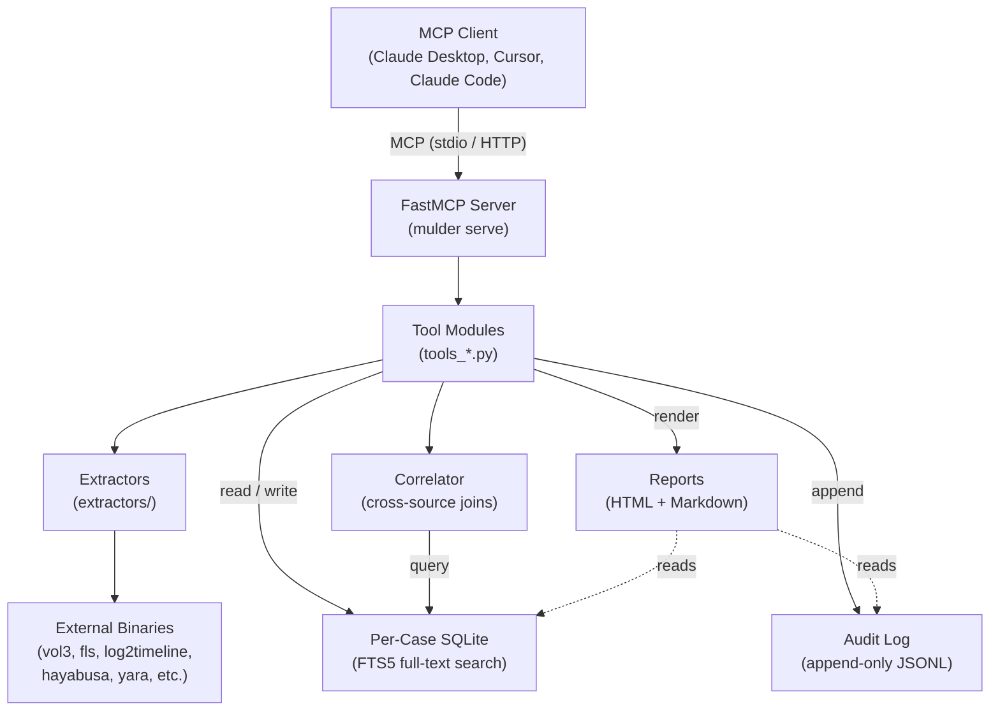
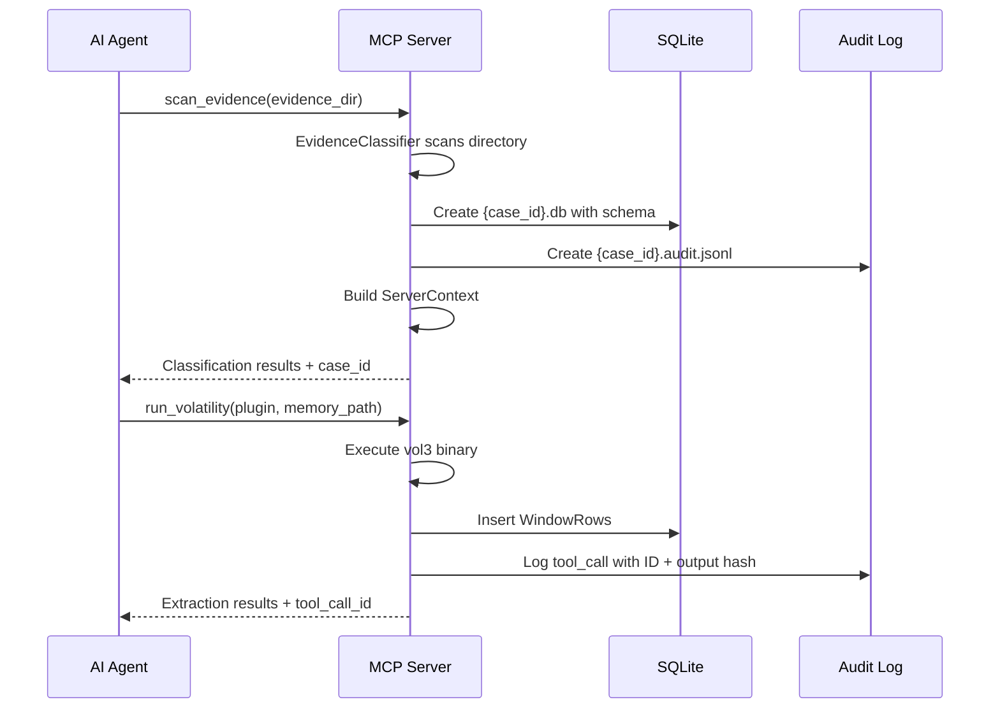
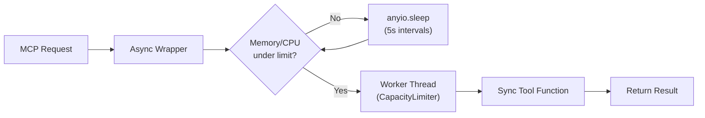
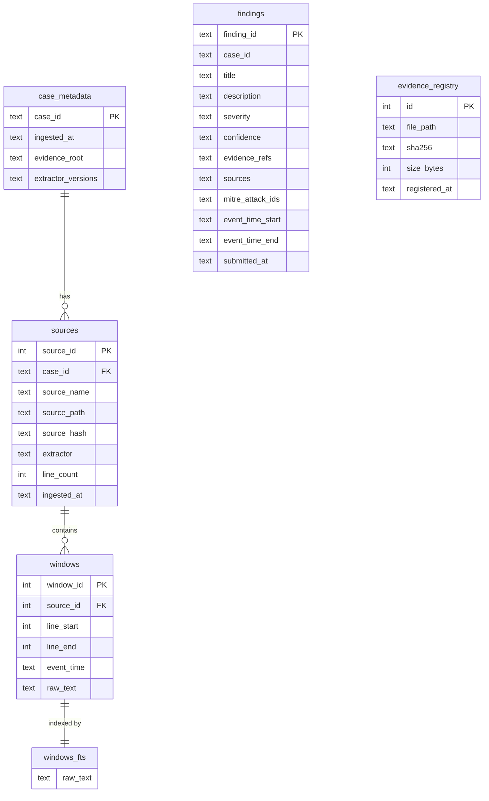
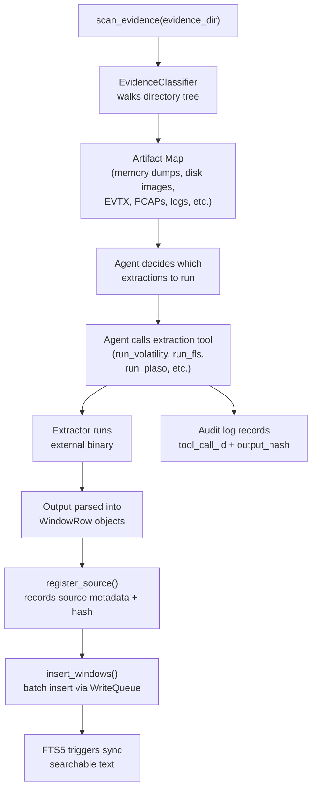

# Architecture

Mulder is an MCP (Model Context Protocol) server that exposes digital forensic tooling to AI agents. It wraps dozens of external forensic binaries and Python libraries behind a uniform MCP tool interface, indexes all extracted evidence into a per-case SQLite database with full-text search, maintains an append-only audit log for provenance, and generates structured investigation reports.

## Project Structure

```
src/mulder/
├── __init__.py                   # Package version
├── cli.py                        # Click CLI (serve, report)
├── db.py                         # Per-case SQLite lifecycle, schema, queries, WriteQueue
├── models.py                     # Pydantic models (WindowRow, Finding, AuditSummary, etc.)
├── audit.py                      # Append-only JSONL audit log
├── extractors/
│   ├── classifier.py             # Evidence directory scanner and artifact type detection
│   ├── base.py                   # Base extractor interface
│   ├── volatility.py             # Volatility 3 wrapper
│   ├── sleuthkit.py              # Sleuthkit (fls, icat, mmls) wrapper
│   ├── plaso.py                  # Plaso (log2timeline) wrapper
│   ├── bulk.py                   # bulk_extractor wrapper
│   ├── disk.py                   # Disk image helpers
│   ├── logs.py                   # Log file ingestion
│   └── eztools.py                # Eric Zimmerman tools wrapper
├── index/
│   └── correlator.py             # Cross-source time-range joins
├── report/
│   ├── renderer.py               # Jinja2 report builder, IOC extraction, MITRE rollups
│   ├── redactor.py               # Sensitive data redaction helpers
│   └── templates/
│       ├── report.md.j2          # Markdown report template
│       └── report.html.j2        # HTML report template (dark/light, sidebar nav)
└── server/
    ├── app.py                    # FastMCP instance, init, concurrency wrappers, run_parallel
    ├── helpers.py                # Shared helpers (hashing, batch IDs, output formatting)
    ├── jobs.py                   # Background JobStore for async extraction batches
    ├── extract_helpers.py        # Common extraction utilities
    ├── tools_case.py             # scan_evidence, open_case, list_cases, extract_archive
    ├── tools_extract.py          # Volatility, Sleuthkit, Plaso, EVTX, Registry, bulk_extractor, etc.
    ├── tools_core.py             # search, correlate, process queries, decode_payload
    ├── tools_composite.py        # Multi-source hunting (persistence, lateral movement, exfil, etc.)
    ├── tools_findings.py         # submit_finding, get_findings, finalize_report
    ├── tools_plaso.py            # Plaso timeline filtering and export
    ├── tools_hayabusa.py         # Hayabusa Windows event log analysis
    ├── tools_yara.py             # YARA scanning (files, memory, Volatility integration)
    ├── tools_tsk.py              # Sleuthkit convenience tools (partitions, deleted files, inodes)
    ├── tools_eztools.py          # Eric Zimmerman artifact parsers
    ├── tools_bulk.py             # Bulk extractor IOC summary
    ├── tools_phone.py            # Mobile forensics (Android, iOS, SQLCipher)
    ├── tools_artifacts.py        # Browser history, plist, SQLite from image, steganography
    ├── tools_attack.py           # MITRE ATT&CK technique lookup
    └── tools_jobs.py             # Extraction batch management
```

## High-Level Architecture



## Server Lifecycle

### Startup

The `mulder serve` command in `cli.py` performs the following sequence:

1. Expands `--db-dir` (default `~/.mulder/cases`) and creates it if missing
2. Configures file logging to `{db_dir}/mulder.log`
3. Calls `init_server()` which creates:
   - A `ServerConfig` dataclass holding immutable settings (db_dir, max_workers, resource limits)
   - A `JobStore` for background extraction batches
   - Optionally pre-loads a case if `--case-id` is given
4. Calls `mcp.run(transport=...)` to start listening for MCP messages

### ServerConfig vs ServerContext

`ServerConfig` is created once at startup and never changes. It holds the database directory path, worker count, and resource limits.

`ServerContext` is created each time a case is loaded (via `scan_evidence`, `open_case`, or `--case-id`). It holds:
- `case_id`: the active case identifier
- `db`: a `CaseDB` instance connected to `{case_id}.db`
- `correlator`: a `Correlator` instance for cross-source queries
- `audit`: an `AuditLog` instance writing to `{case_id}.audit.jsonl`

Only one case can be active at a time. Loading a new case closes the previous context.

### Case Creation



## Tool Execution Model

### Sync-to-Async Wrapping

All MCP tools are registered through a custom `mcp.tool()` decorator that wraps synchronous tool functions in an async shell. The wrapper:

1. Calls `async_wait_for_resources()` to check memory/CPU pressure, yielding to the event loop via `anyio.sleep` if thresholds are exceeded
2. Dispatches the sync function to a worker thread via `anyio.to_thread.run_sync` with a shared `CapacityLimiter`

This keeps the MCP event loop responsive to heartbeats and new requests while tools perform blocking I/O.



### CapacityLimiter

The `CapacityLimiter` is bounded by the `--workers` flag (default 8). This limits how many tool functions execute concurrently in worker threads, preventing resource exhaustion when the agent dispatches many tools at once.

### Resource Throttling

Before each tool execution, Mulder checks system memory and CPU usage via `psutil` (falling back to `/proc/meminfo` and `/proc/loadavg` on Linux). If either metric exceeds the configured threshold (default 90%), the tool waits in 5-second intervals for up to 5 minutes before proceeding anyway.

Two variants exist:
- `async_wait_for_resources()` uses `anyio.sleep` for MCP tool calls (keeps the event loop alive)
- `wait_for_resources()` uses `time.sleep` for background `JobStore` threads

### run_parallel

The `run_parallel` meta-tool accepts a list of `{tool, args}` objects and executes them concurrently in an `anyio` task group. Tools listed in `_SEQUENTIAL_ONLY` (currently just `run_bulk_extractor`) are run sequentially after the parallel batch completes, to avoid overwhelming system resources.

## Data Model



### Tables

- **case_metadata**: one row per case, storing the evidence root path and extractor version info
- **sources**: one row per ingested evidence source (a Volatility plugin output, a disk image FLS listing, etc.), keyed to a case
- **windows**: line-oriented text chunks from extractor output, each belonging to a source. The primary unit of searchable evidence.
- **windows_fts**: an FTS5 virtual table that mirrors `windows.raw_text` for full-text search
- **findings**: agent-submitted investigation findings with severity, confidence, MITRE ATT&CK IDs, and evidence references
- **evidence_registry**: SHA-256 chain-of-custody records for original evidence files

## Evidence Pipeline



The key design choice is that the agent controls which extractions run. `scan_evidence` only classifies files by type (memory dump, disk image, EVTX, PCAP, etc.); it does not automatically run any extractors. The agent then selectively calls Tier 2 extraction tools to populate the database.

## Extractors

Each extractor module wraps one or more external forensic tools and normalizes their output into `WindowRow` objects for database insertion.

| Module | External Tool(s) | Artifact Types |
|--------|-------------------|----------------|
| `volatility.py` | Volatility 3 (`vol`) | Memory dumps (.mem, .vmem, .dmp) |
| `sleuthkit.py` | Sleuthkit (`fls`, `icat`, `mmls`, `fsstat`, `mactime`) | Disk images (.e01, .dd, .img) |
| `plaso.py` | Plaso (`log2timeline`, `psort`) | Super-timeline from any supported format |
| `bulk.py` | `bulk_extractor` | Carved IOCs (emails, URLs, credit cards, etc.) |
| `eztools.py` | Eric Zimmerman .NET tools (`PECmd`, `AmcacheParser`, `AppCompatCacheParser`, `JLECmd`, `LECmd`, `SBECmd`, `SrumECmd`, `MFTECmd`) | Windows artifacts (prefetch, amcache, shimcache, jump lists, LNK, shellbags, SRUM, MFT, USN journal) |
| `logs.py` | None (Python native) | Plain text log files |
| `disk.py` | Sleuthkit utilities | Disk image metadata and file extraction |

Additional tools invoked directly from `tools_extract.py` without a dedicated extractor module:

| Tool | What It Does |
|------|--------------|
| `hayabusa` | Windows event log threat hunting with Sigma rules |
| `yara` | Pattern matching across files, memory, or Volatility output |
| `exiftool` | File metadata extraction |
| `clamav` (`clamscan`) | Malware scanning |
| `hashdeep` | Recursive cryptographic hashing |
| `foremost` / `scalpel` / `photorec` | File carving and recovery |
| `ssdeep` | Fuzzy hashing for similarity matching |
| `tshark` | PCAP network capture analysis |
| `binwalk` | Firmware and embedded file analysis |
| `chkrootkit` | Rootkit detection |
| `regripper` | Windows registry hive parsing |
| `pasco` | Internet Explorer index.dat parsing |
| `stegdetect` / `steghide` | Steganography detection and extraction |

## Audit and Provenance

### Audit Log

Each case has an append-only JSONL file (`{case_id}.audit.jsonl`) that records three entry types:

1. **tool_call**: every MCP tool invocation, with `tool_call_id`, parameters, SHA-256 hash of the output, timestamp, and duration
2. **ingestion**: each source extraction, recording source path, hash, extractor name, window count, and duration
3. **finding**: each finding submission, recording the finding ID and its evidence references

The log is append-only and never modified after writing. An in-memory index of all `tool_call_id` values is maintained for fast lookups.

### Anti-Hallucination Guardrail

When the agent calls `submit_finding`, every entry in the `evidence_refs` list is validated against the audit log's set of recorded `tool_call_id` values. If any reference does not match a real tool invocation, the finding is rejected. This prevents the agent from fabricating evidence citations.

### Provenance Chains

The `get_provenance_chain()` method traces a finding back through:

1. The `evidence_refs` tool call IDs cited by the finding
2. The tool call parameters (which contain source names)
3. The `sources` table in the database (original file paths and SHA-256 hashes)

This produces a full chain from finding to tool invocation to original evidence file.

## Cross-Source Correlation

The `Correlator` class in `index/correlator.py` performs time-bounded joins across evidence sources. Given a time range and an optional list of source names, it queries the `windows` table for each source and returns all matching windows grouped by source.

This lets the agent answer questions like "at timestamp T, what did each artifact type observe?" by pulling memory analysis, disk timeline, event logs, and network captures into a single correlated view.

## Report Generation

The `ReportRenderer` in `report/renderer.py` uses Jinja2 templates to produce Markdown and HTML reports.

### Rendering Pipeline

1. **Aggregate findings** sorted by severity (critical, high, medium, low, info)
2. **Extract IOCs** from finding descriptions using regex patterns for IP addresses, ports, file paths, hashes, and email addresses
3. **Build MITRE ATT&CK rollups** mapping technique IDs to findings
4. **Generate executive summary** text from findings counts and severity distribution
5. **Render template** with case metadata, findings, IOC tables, audit summary, evidence integrity records, and source listings

### Templates

- **`report.md.j2`**: Markdown report with sections for executive summary, severity overview, evidence integrity, attack timeline, detailed findings, ruled-out findings, IOC tables, MITRE coverage, audit metrics, and sources appendix
- **`report.html.j2`**: Self-contained HTML page (~1500 lines) with dark/light theme toggle, sidebar navigation, and the same content sections. Source window samples are capped at 50 per source to keep file size manageable.

## Concurrency and Write Safety

### WriteQueue

SQLite does not support concurrent writers. Mulder handles this with a `_WriteQueue`: a dedicated daemon thread that drains a `queue.Queue` of write callables. Worker threads submit write operations via `_WriteQueue.submit()` and block until the writer thread executes them and signals completion.

This eliminates `SQLITE_BUSY` errors entirely because only one thread ever holds the write lock.

### SQLite Configuration

Each new database connection sets three PRAGMAs:

- **`journal_mode=WAL`**: allows concurrent readers while one writer holds the lock
- **`foreign_keys=ON`**: enforces referential integrity between tables
- **`busy_timeout=30000`**: if the write lock is held (which should not happen with the WriteQueue, but serves as a safety net), SQLite retries for up to 30 seconds before returning `SQLITE_BUSY`

The engine uses `NullPool` so each `engine.begin()` / `engine.connect()` gets a fresh connection. The PRAGMA listener fires on every new connection since NullPool discards connections after use.

### Thread Safety

- `ServerContext` is protected by a `threading.Lock` for safe case switching
- The `AuditLog` uses a `threading.Lock` around file appends and index updates
- The `_WriteQueue` serializes all database mutations through a single thread
- Read operations (search, correlation, listing) go directly through SQLAlchemy without the WriteQueue since WAL mode allows concurrent reads
