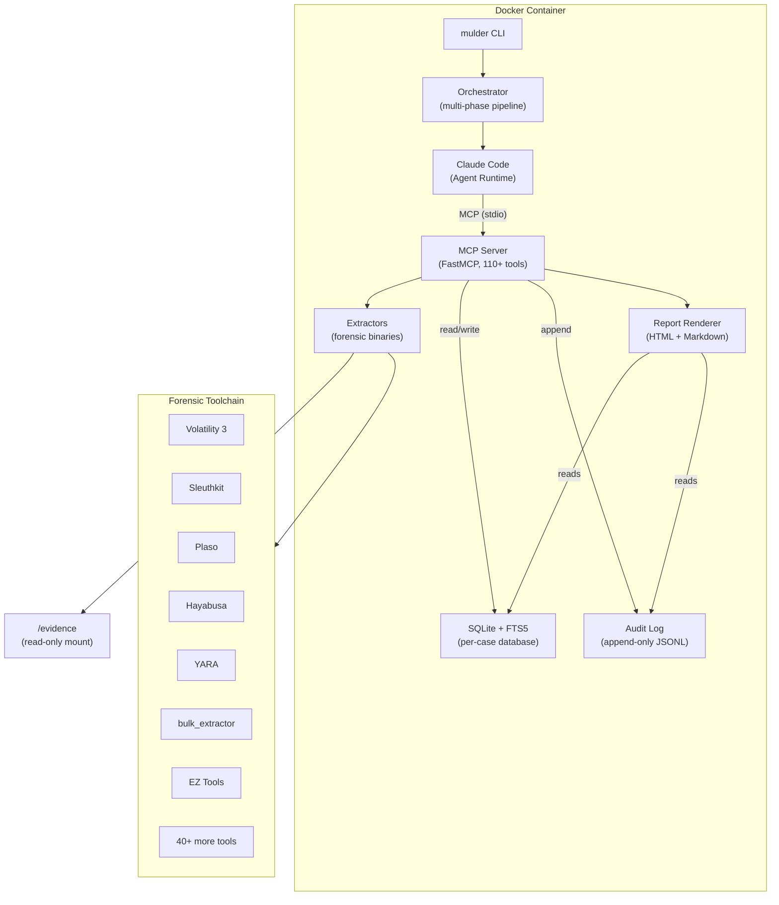
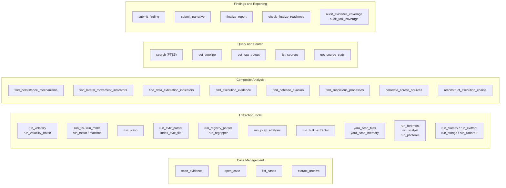
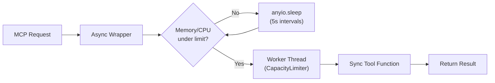
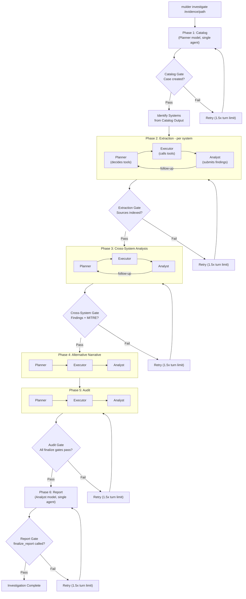
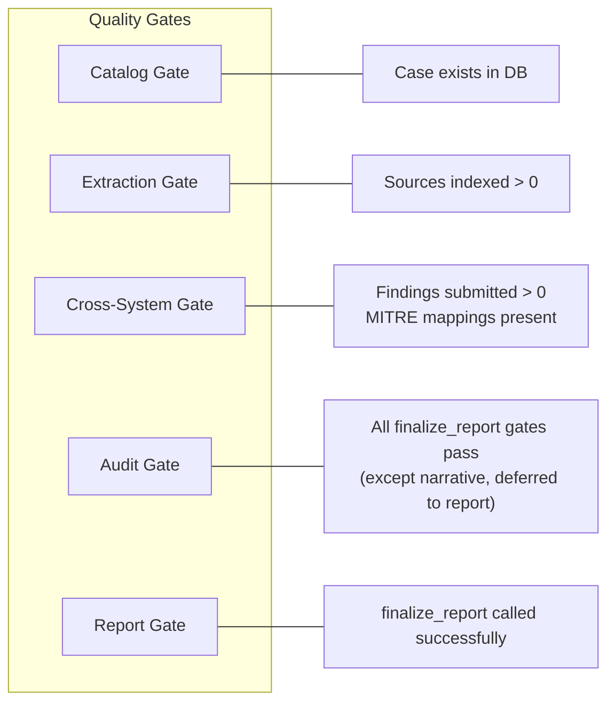
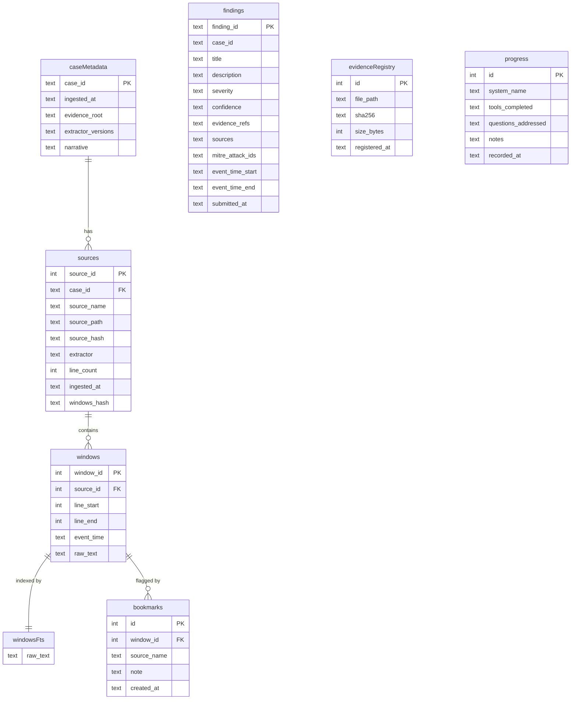

# Architecture

Mulder is a forensic investigation platform consisting of two core components: an MCP server that exposes 110+ typed forensic tools with no shell access, and an agentic orchestrator that runs multi-phase investigations with quality gates.

## System Overview



## MCP Server Architecture

The MCP server (`mulder serve`) uses [FastMCP](https://github.com/jlowin/fastmcp) to expose forensic tools over the Model Context Protocol. It supports both `stdio` and `streamable-http` transports.

### Tool Categories



### Resource Throttling

Every tool call passes through an async resource gate before execution:



The `CapacityLimiter` bounds concurrent tool execution to the `--workers` count (default 8). The `--mem-limit` and `--cpu-limit` flags set thresholds (default 90%) above which tools wait before proceeding.

## Orchestration Pipeline

The orchestrator (`mulder investigate`) runs six investigation phases sequentially. Most phases use a plan-and-execute pipeline (planner/executor/analyst) while catalog and report use single-agent sessions. The orchestrator uses the [Claude Agent SDK](https://docs.anthropic.com/en/docs/agents/claude-code-sdk) (`claude-agent-sdk`) for managing agent sessions.



The Alternative Narrative phase (Phase 4) is advisory: it has no hard quality gate and always proceeds to the audit phase regardless of output.

### Phase Configuration

Each phase is defined by a `PhaseConfig` dataclass specifying:

- **Pipeline mode**: Either `split` (planner/executor/analyst) or `single` (one agent session)
- **Tool whitelist**: Per-role tool access; planners get discovery tools, executors get action tools, analysts get query tools
- **Model assignment**: Each role resolves its model via `ModelConfig.resolve(phase, role)` with support for per-phase overrides via config file
- **Turn limit**: Maximum tool-use round trips per role session
- **Follow-up limit**: Maximum planner/executor cycles the analyst can request before being capped
- **Workers**: Configurable via `--workers` for concurrent extraction sessions
- **Auto-compaction**: When context is exhausted mid-phase, the orchestrator restarts with a compact prompt that recovers state from the database
- **Retry policy**: Maximum retries with 1.5x turn limit multiplier on each retry

### Deferred Retry System

When a quality gate fails after a phase completes, the orchestrator retries with escalating budgets:

1. **Budget multiplier**: Each retry gets 1.5x the previous attempt's turn limit
2. **Gap-specific remediation**: The gate reports specific gaps (e.g., "no sources indexed", "no MITRE mappings"), which are prepended to the retry prompt so the agent focuses on what's missing
3. **Follow-up cycles**: Within a single attempt, the analyst can request additional planner/executor iterations (capped at `max_follow_ups`) when it identifies gaps that need more tool execution
4. **Auto-compaction on exhaustion**: If context is exhausted mid-phase, the orchestrator restarts with a compact prompt that preserves state via the database rather than failing immediately

The retry system is bounded: each phase allows up to 2 retries (configurable), after which it reports failure and the investigation proceeds with partial results.

### Phase Gates



When a gate fails, the orchestrator retries the phase with:
- 1.5x the original turn limit
- Gap-specific instructions prepended to the prompt (e.g., "No sources indexed after extraction")
- Up to 2 retries per phase (configurable)

## Database Schema

Each investigation case uses a dedicated SQLite database with WAL mode for concurrent reads and a serialized write queue for thread safety.



### Key Tables

- **case_metadata**: One row per case with evidence root path, extractor versions, and the investigation narrative (set via `submit_narrative`)
- **sources**: One row per ingested evidence source (a Volatility plugin output, an FLS listing, etc.). The `windows_hash` column stores a BLAKE2b digest of all window content for integrity verification (BLAKE2b is used for window-content integrity, chosen for speed on large payloads; SHA-256 is used for evidence chain-of-custody, chosen for standard forensic interoperability).
- **windows**: Character-budget chunks (4,096 chars each) from extractor output. The primary unit of searchable evidence.
- **windows_fts**: FTS5 virtual table mirroring `windows.raw_text` for full-text keyword search
- **findings**: Agent-submitted investigation findings with severity, confidence, MITRE ATT&CK IDs, timestamps, and evidence references
- **evidence_registry**: SHA-256 chain-of-custody records for original evidence files
- **bookmarks**: Agent-flagged windows of interest for later review
- **progress**: Per-system records of tools executed and questions addressed

### Write Safety

SQLite does not support concurrent writers. Mulder serializes all writes through a `WriteQueue`: a dedicated daemon thread that drains a queue of write callables. Worker threads submit operations and block until completion. This eliminates `SQLITE_BUSY` errors entirely.

Read operations bypass the queue since WAL mode allows concurrent readers.

## Rich Live Dashboard

The orchestrator displays a real-time terminal dashboard using Rich's Live display:

```
+----------------------------------------- Mulder ------------------------------------------+
| [3/7] Phase 2: Deep Extraction: HOST01                                                    |
| claude-sonnet-4-6 | max turns: 75                                                        |
| Tools: 47          Findings: 5          Tokens: 1.2M          20.1K/min                   |
| CPU: 45%           MEM: 6.2/16 GB (39%)   12:34                                          |
|   sonnet-4-6       890K in / 312K out     1.2M                                            |
|   haiku-4          15K in / 3K out        18K                                             |
+-------------------------------------------------------------------------------------------+
| ==========================================================                                |
|   [3/7] Phase 2: Deep Extraction: HOST01                                                  |
|   Model: claude-sonnet-4-6 | Max turns: 75                                               |
|   > run_volatility_batch                                                                  |
|   > run_evtx_parser                                                                       |
|   [HIGH] Persistence Mechanism Detected                                                   |
|   > search                                                                                |
|   PASS  Phase 2: Deep Extraction: HOST01 (42 turns)                                      |
+-------------------------------------------------------------------------------------------+
```

The dashboard has two panels:
- **Stats header**: Current phase, tool count, finding count, token usage (total and per-model), throughput, system resources, elapsed time
- **Scrolling log**: Assistant reasoning, tool calls, findings (color-coded by severity), gate results

## Evidence Classification and Extractor Framework

The `EvidenceClassifier` scans evidence directories and categorizes files by type:

| Evidence Type | Extensions / Indicators | Primary Tools |
|---------------|------------------------|---------------|
| Memory dump | `.mem`, `.vmem`, `.dmp`, `.raw` (large) | Volatility 3, YARA |
| Disk image | `.e01`, `.dd`, `.vmdk`, `.vhd`, `.img` | Sleuthkit, Plaso, bulk_extractor |
| Windows event log | `.evtx` | python-evtx, Hayabusa |
| Network capture | `.pcap`, `.pcapng` | tshark, tcpflow |
| Phone dump | Android/iOS directory structures | MVT |
| Archive | `.zip`, `.7z`, `.tar`, `.gz` | Internal extraction |
| Log directory | `/var/log/*`, text files | Native parsing |

Each extractor normalizes output into `WindowRow` objects (source_id, line_start, line_end, event_time, raw_text) for uniform database storage and FTS indexing.

## Docker Deployment Architecture

```mermaid
flowchart TB
    subgraph host [Host System]
        evidenceDir["/path/to/evidence"]
        casesDir["~/mulder-cases"]
        claudeDir["~/.claude"]
        creds["API credentials"]
    end

    subgraph container [Container (ubuntu:22.04)]
        subgraph runtime [Runtime Layer]
            entrypoint["entrypoint.sh\n(credential setup, permission fixups)"]
            mulderUser["mulder user (non-root)"]
        end

        subgraph app [Application Layer]
            mulderCLI["mulder CLI"]
            orchestrator2["Orchestrator"]
            claudeCode2["Claude Code (Agent Runtime)"]
            mcpServer2["MCP Server (FastMCP)"]
        end

        subgraph tools [Forensic Tools Layer]
            python312["Python 3.12"]
            node22["Node.js 22"]
            forensicBins["vol3, fls, plaso, hayabusa,\nyara, bulk_extractor, EZ tools,\nradare2, clamav, mvt, ..."]
            symbolTables["Volatility symbols\n(Windows + Linux)"]
            yaraRules["YARA rules\n(signature-base + yara-rules)"]
            attackData["MITRE ATT&CK STIX data"]
        end
    end

    evidenceDir -->|":ro mount"| mulderCLI
    casesDir -->|"mount"| mcpServer2
    claudeDir -->|"mount"| claudeCode2
    creds -->|"env vars"| entrypoint
    entrypoint --> mulderUser
    mulderUser --> mulderCLI
```

The container runs with `--privileged` (or `--cap-add SYS_ADMIN`) to support disk image mounting via `ewfmount`, `guestmount`, and `mount`.

## Evidence Reference Validation

The `submit_finding` tool performs server-side evidence-ref validation: every `tool_call_id` cited in a finding's `evidence_refs` is verified against the append-only audit log. Findings that reference non-existent tool invocations are rejected, preventing hallucinated evidence citations.

### Global Consistency Analysis

Before the audit phase, the orchestrator builds a dedup index from all findings, grouping them by shared IOCs (IPs, file paths, process names) extracted via regex to identify per-host duplicates of the same artifact. This consistency analysis is prepended to the audit phase prompt so the agent acts on code-discovered clusters rather than re-deriving them from raw text.

## Security Model

### No Shell Access

The MCP server exposes only typed tool functions. Shell, Bash, and arbitrary command execution are explicitly blocked in both the MCP server permissions and in each phase's `disallowed_tools` list. All evidence access goes through audited MCP tools.

### Read-Only SQLite Authorizer

The `query_sqlite_from_image` tool allows SQL queries against SQLite databases found in evidence. A custom authorizer callback restricts the connection to read-only operations, blocking `INSERT`, `UPDATE`, `DELETE`, `DROP`, `ALTER`, `ATTACH`, `DETACH`, `CREATE`, and `load_extension` at the SQLite engine level.

### Evidence Reference Validation

When the agent calls `submit_finding`, every entry in `evidence_refs` is validated against the audit log's set of recorded `tool_call_id` values. If any reference does not match a real tool invocation, the finding is rejected. This prevents hallucinated evidence citations.

### Path Traversal Protection

`read_evidence_file` and `list_directory` validate that requested paths resolve to allowed roots using `Path.resolve()` for symlink canonicalization. Archive extraction filters prevent Zip Slip and tar traversal attacks.

### FTS5 Query Sanitization

Full-text search queries are sanitized before execution. Special characters with FTS5 syntax meaning are escaped, and pipe-separated terms (common LLM mistakes) are converted to proper `OR` operators.

### Non-Root Container

All processes run as the `mulder` user via `gosu`. The entrypoint handles credential copying and ownership fixups before dropping privileges.

## Per-Model Token Tracking

The orchestrator uses a planner/executor/analyst role system for model assignment. Each role maps to a CLI flag with built-in defaults:

| CLI Flag | Role | Default Model | Responsibility |
|----------|------|--------------|----------------|
| `--planner-model` | Planner | `claude-sonnet-4-6` | Decides what tools to run, produces execution plans |
| `--executor-model` | Executor | `claude-haiku-4-5` | Calls tools mechanically, manages waits and retries |
| `--analyst-model` | Analyst | `claude-sonnet-4-6` | Queries indexed data, reasons about evidence, submits findings |
| `--model` | Fallback | None | Sets all roles when per-role flags are not specified |

Single-mode phases map to roles: catalog uses the planner model, report uses the analyst model. Per-phase overrides can be specified in a YAML config file via `--config`.

All roles inherit from `--model` if not specified individually, enabling single-model deployments (e.g., Bedrock or Vertex with one model identifier).

## Audit and Provenance

Each case has an append-only JSONL file (`{case_id}.audit.jsonl`) recording:

1. **tool_call**: Every MCP tool invocation with `tool_call_id`, parameters, SHA-256 hash of output, timestamp, duration, and optional `batch_id`
2. **ingestion**: Each source extraction with source path, hash, extractor name, window count, and duration
3. **finding**: Each finding submission with finding ID and evidence references

### Provenance Chain

A finding can be traced back to original evidence through:
1. `evidence_refs` tool call IDs cited by the finding
2. Tool call parameters (containing source names)
3. `sources` table (original file paths and SHA-256 hashes)
4. `evidence_registry` table (chain-of-custody SHA-256 records)

## Cross-Source Correlation

The `Correlator` class performs time-bounded joins across evidence sources. Given a time range, it queries the `windows` table for events from all sources and returns them grouped by source name. This enables the agent to answer "at timestamp T, what did each artifact type observe?" by correlating memory analysis, disk timeline, event logs, and network captures.

## Report Generation

The `ReportRenderer` uses Jinja2 templates to produce both Markdown and HTML reports:

1. Aggregate findings sorted by severity
2. Extract IOCs from descriptions using regex patterns
3. Build MITRE ATT&CK tactic rollups from technique IDs
4. Convert finding descriptions from markdown to HTML
5. Generate executive summary from severity distribution
6. Render template with all case data, narrative, findings, audit metrics, and source listings

### Output Formats

- **Markdown** (`{case_id}.report.md`): Plain-text report for version control and review
- **HTML** (`{case_id}.report.html`): Self-contained styled page with dark/light theme toggle, sidebar navigation, per-model token usage breakdown, and collapsible source window samples

## Limitations and Known Considerations

- **Accuracy:** Findings are classified as "confirmed" or "inference". The system does not guarantee zero false positives. The alternative narrative phase challenges findings but does not eliminate all confabulation risk.
- **Evidence admissibility:** Reports are intended as investigative aids. Chain-of-custody records (SHA-256 hashes, append-only audit logs) do not guarantee legal admissibility.
- **LLM failure modes:** The model may misinterpret benign artifacts as malicious. Evidence-ref validation prevents fabricated citations but not incorrect interpretations. The planner/analyst split mitigates this by separating tool execution from reasoning.
- **Adversarial evidence:** Attackers aware of AI analysis could craft evidence to mislead the model. The adversarial evidence warning in system prompts mitigates but does not eliminate this risk.
